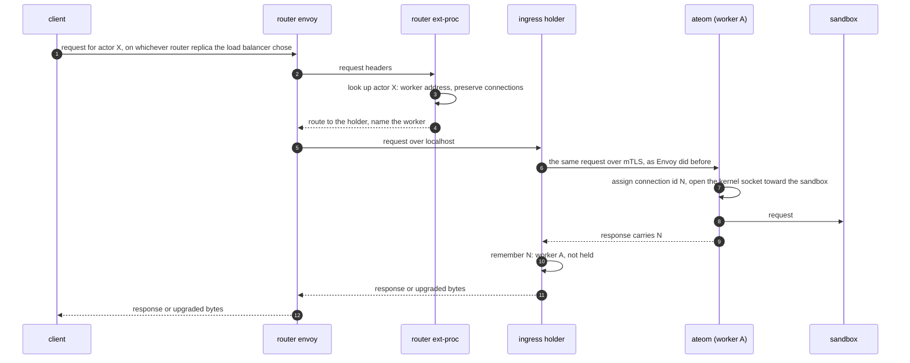
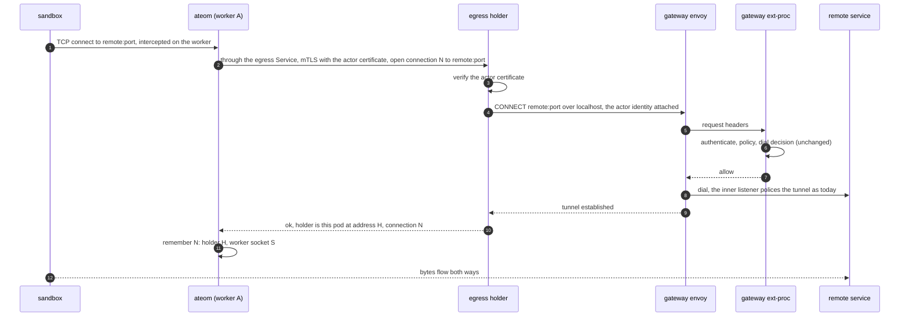
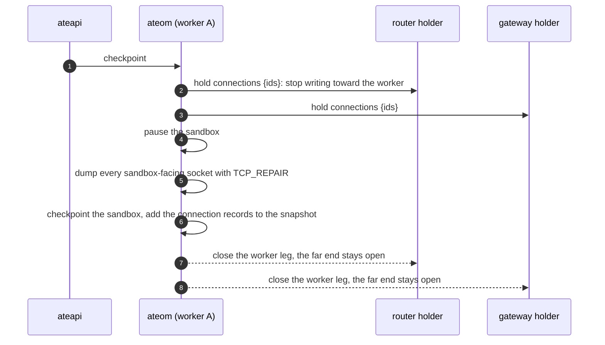
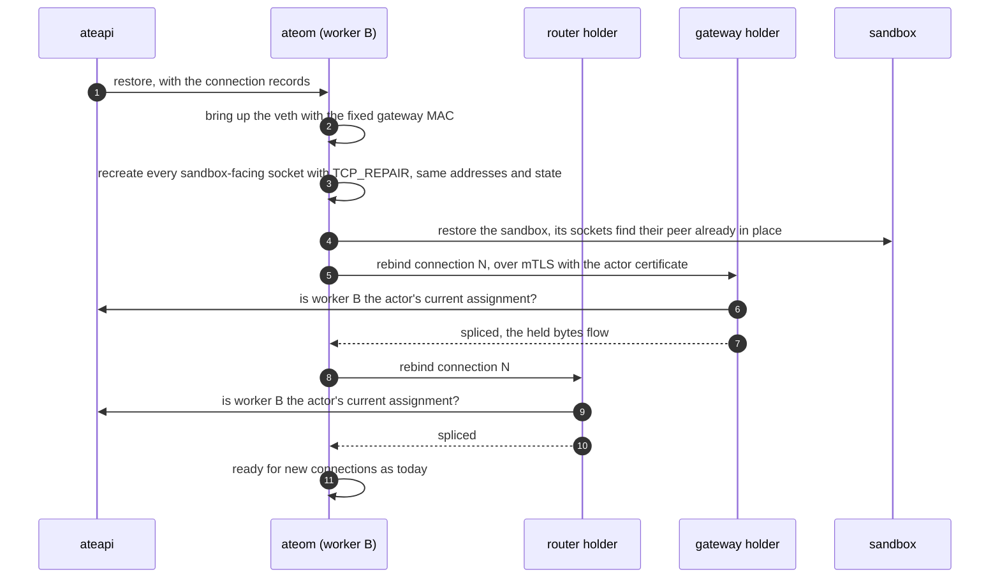

# Keeping an actor's TCP connections alive across suspend and resume, without a new component

Status: design for discussion. Nothing here is implemented yet. Tracks
[#465](https://github.com/agent-substrate/substrate/issues/465).

## The idea

Every connection an actor holds has two halves, and the snapshot already
saves one of them: gVisor keeps connected sockets, so the actor's half of
every connection survives a checkpoint today. The half that is lost is its
peer inside ateom on the worker: the socket ateom's proxy opened into the
sandbox for an inbound request, or the socket ateom accepted when it
intercepted an outbound connection. Beyond ateom, the client's connection
ends at the router's Envoy and the remote service's connection ends at the
egress gateway's Envoy, both in pods that do not move.

Three facts turn that into a design with no new component:

1. The far ends do not have to move, they have to wait. The router's Envoy
   and the gateway's Envoy keep their legs open as long as their upstream
   stays open, so something in those pods has to stand in for the worker
   while the actor is away.
2. The only socket that must move is ateom's sandbox-facing one, and it is
   bound to the same link-local gateway address on every worker,
   `169.254.17.1`. It has a state problem, not an address problem, and Linux
   can move state: `TCP_REPAIR` lets a privileged process dump a live
   socket and recreate it elsewhere with the same addresses, ports and
   sequence numbers, with no handshake.
3. Waking the actor needs the process that sees data arrive for it. That is
   whoever holds the far end, and both the router pod and the gateway pod
   already run a Go process next to Envoy that talks to the control plane.

So: a small *holder* inside each of those two existing processes keeps the
Envoy-facing leg of a connection open while the worker leg is gone, pauses the
far end by not reading, and asks ateapi to resume the actor when bytes arrive.
ateom carries its own half of each connection inside the snapshot and rebuilds
it on the new worker before the sandbox restarts.

No new Deployment, no userspace network stack, no raw frame tunnel. ateom stays
the sandbox's TCP peer, as it is today.

## Components

```mermaid
flowchart LR
    C[client] --> RE[router pod, envoy container]
    RE -- preserved actor, localhost --> RH[router pod, atenet-router container:<br/>ingress holder]
    RE -- other actors, unchanged --> AI
    RH -- mTLS, per request --> AI[worker: ateom atunnel ingress]
    AI -- kernel socket, moved with TCP_REPAIR --> SB[sandbox]
    SB -- intercepted --> AE[worker: ateom atunnel egress]
    AE -- mTLS with the actor certificate --> GH[gateway pod, ext-proc container:<br/>egress holder]
    GH -- localhost --> GE[gateway pod, envoy container:<br/>outer listener, inner listener]
    GE --> R[remote service]
    RH -. ResumeActor on held data .-> API[ateapi]
    GH -. ResumeActor on held data .-> API
```

Only actors whose template opts in (`ate.dev/connection-policy: Preserve`)
take the holder paths. Every other actor keeps today's data path unchanged.

The holders are not new programs. The ingress holder is a listener inside the
`atenet-router` container that already runs the router's xDS server and
ext-proc. The egress holder is a listener inside the `ext-proc` container of
the gateway pod. Same process, same container, same pod; each pod's Service
gains one port so workers can reach the holder.

## A new connection

### Inbound

The router replica that receives the request is the one whose holder keeps
the connection. The holder is a per-request proxy: a plain HTTP response ends
the worker leg, a WebSocket or CONNECT keeps it until the connection closes.

### Outbound

New outbound connections go through the egress Service and are balanced per
connection, as today's tunnels are. The replica that lands a connection
becomes its holder and names itself in the reply. The gateway's authorization
and its destination policing see exactly the request they see today.

## Suspend

The hold comes first, so nothing new reaches the sandbox between the hold and
the checkpoint, and the dumped socket state matches the frozen sandbox. Each
holder answers with its own address and the ids it keeps, and that goes into
the snapshot next to the socket state. Segments in flight on the wire at that
instant are recovered by ordinary TCP retransmission after restore, because
sequence numbers are preserved on both sides.

## While the actor sleeps

- The holder stops reading from Envoy. TCP flow control pauses the remote
  service (outbound) or the client (inbound). Nothing is dropped; bounded
  kernel buffers hold what has arrived.
- Keepalives and HTTP/2 pings are answered by Envoy's own kernel. Only
  application bytes count as data.
- The first byte for a held connection makes the holder call ateapi to
  resume the actor. Attempts are rate limited per actor and retried while
  data is still waiting.
- A hold has a time limit. When it runs out, or when the actor turns out to
  be deleted, the far end gets an ordinary close.

## Resume on another worker

The rebind dials the holder's recorded pod address directly, not the Service,
because it must reach the one replica that is holding that connection. That is
what per-connection stickiness means in practice: one actor with several
connections may have holders on several router replicas and several gateway
replicas, and a resume rebinds to each of them.

If a holder pod is gone, that rebind fails and ateom closes the restored
socket with a reset. The application sees the same error it would see today
after any resume. Degradation is to current behavior, never worse.

Two small things make this work for every worker, not only preserved actors:
the worker side of the sandbox's veth gets a fixed MAC address on all workers,
so the restored sandbox's ARP entry for its gateway stays valid; and outbound
interception switches from NAT redirection to transparent proxying, so a
recreated socket does not depend on connection-tracking state that only the
old worker had.

## What this gives

- A blocking call inside the actor survives a suspend and a worker change:
  `http.Get`, a database query, a WebSocket read. The code sees one ordinary
  call that returns.
- The actor can be suspended at any point, in-flight traffic included. The
  scheduler no longer needs to reason about connection state.
- Data arriving for a sleeping actor wakes it, so an agent can go to sleep
  while it waits for a slow answer and be back when the answer arrives.
- Everything that decides today keeps deciding: the router's routing and
  resume-on-request, the gateway's actor authentication, destination policy
  and tunnel classification.
- Any TCP protocol, with or without TLS inside. Holders and gateway only move
  bytes.

## What it does not give

- Connections only wait as long as the far ends are willing. Envoy's idle
  timeouts on both pods, the client's own patience, and server-side idle
  limits bound how long an actor can sleep mid-connection.
- A clock keeps running inside the actor. A timeout the actor set on its own
  request counts the time it spent suspended.
- Holders are state inside proxies that roll on every deploy. A holder pod
  restarting during a hold resets the connections it held. Rollouts must
  drain holds, which argues for hold limits of minutes, not hours.
- UDP is not preserved and does not wake.

## How it compares with the anchor design

An earlier design and a working prototype (branch
`feat/connection-preservation`) solve the same problem with a *connection
anchor*: a new Deployment that becomes the TCP peer of every preserved actor
through a userspace network stack, fed raw Ethernet frames from the worker over
a tunnel. The anchor holds both halves of every connection and the worker's
ateom steps out of the data path entirely.

|                              | Anchor                                           | This design                                            |
|------------------------------|--------------------------------------------------|--------------------------------------------------------|
| New components               | One Deployment, a userspace netstack, a frame tunnel | None. New roles inside the router and gateway processes |
| Where the actor's TCP peer is | The anchor                                      | ateom on the worker, as today                          |
| What moves at resume         | Nothing, only the frame tunnel is re-plugged     | ateom's sandbox-facing sockets, by TCP_REPAIR          |
| Data path for preserved actors | Everything through one central pod, in userspace | Today's path plus one localhost hop in each pod        |
| Stickiness                   | Per actor, by construction                       | Per connection, where each connection happened to land |
| Loss on a restart            | All held connections of all actors               | The connections held by that one replica               |
| Egress identity              | The anchor mints the actor's certificate         | Unchanged, the worker holds the actor's certificate    |
| Second implementation of egress | Yes, in the anchor                            | No                                                     |

The anchor is structurally simpler in one respect: it pins per actor and never
has to move a kernel socket. It pays for that with a central component, a
second egress implementation, and a userspace data path. This design keeps the
existing architecture and the existing trust boundaries and spends its
complexity on socket migration instead.

## Open questions for the discussion

1. **Is per-connection stickiness acceptable?** It falls out for free and
   spreads an actor's holds over several replicas. Per-actor pinning would
   need a routing layer on ingress and pinned gateway selection on egress.
2. **How long should a hold last?** Holders live in proxies; a long hold
   pins their rollouts. Minutes feel right; the anchor prototype used a day.
3. **Which inbound protocols first?** HTTP/1.1, WebSocket and raw TCP via
   CONNECT are the clear set. gRPC over HTTP/2 through a holder needs more
   thought.
4. **Relation to the proposals on #465.** The in-sandbox proxy pair moves the
   problem inside the sandbox and needs a message queue; the TCP_REPAIR idea
   raised there is what this design uses, applied to the one socket that
   needs it. Is this the shape the project wants?
