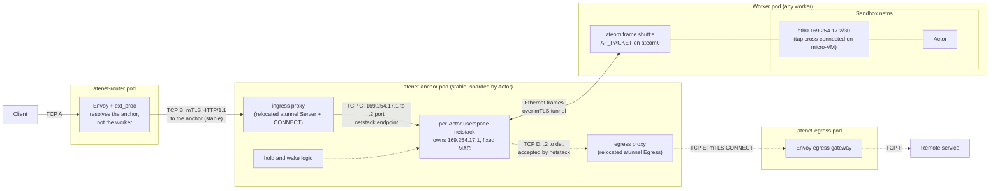
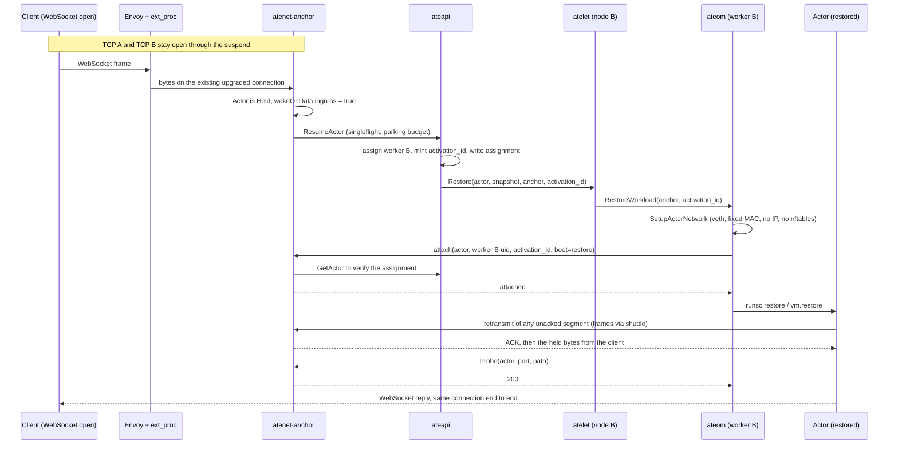
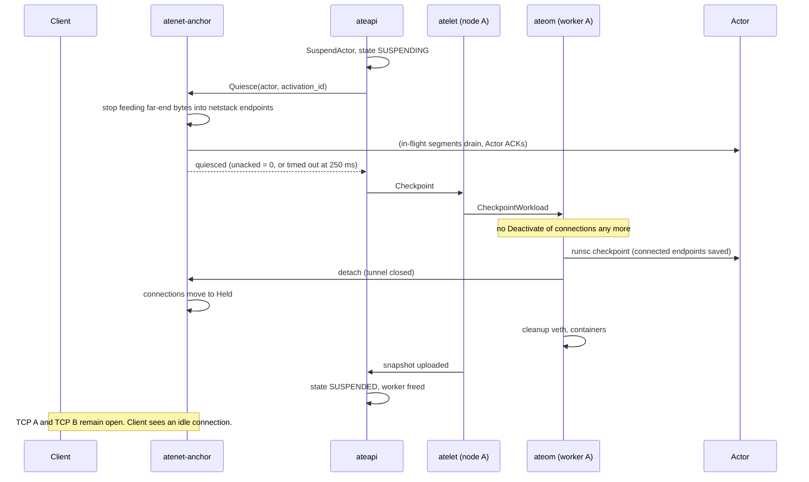
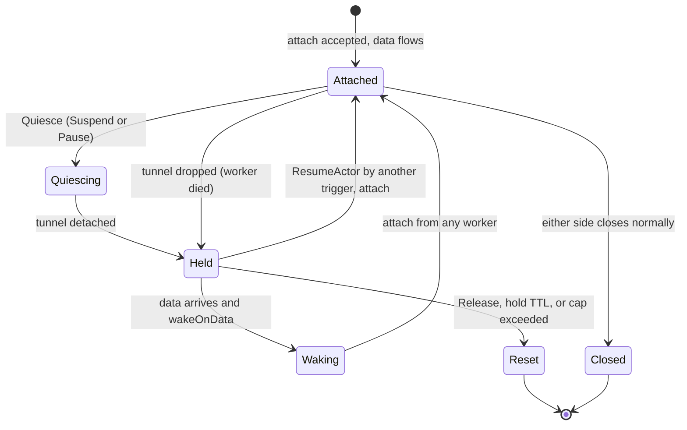

# Connection Preservation Across Suspend and Resume

Status: design proposal, not implemented. Tracks
[#465](https://github.com/agent-substrate/substrate/issues/465) (suspend-safe
actor networking).

## Summary

Today a Suspend deliberately cuts every TCP connection an Actor has open.
The worker cancels in-flight ingress requests and egress streams before the
checkpoint, and the far ends (clients behind the router, remote services behind
the egress gateway) see their connection fail. When the Actor resumes, its
application finds every socket dead and has to reconnect.

This design keeps open TCP connections alive across Suspend and Resume, also
when the Actor comes back on a different worker. The far ends never notice.
The application inside the sandbox never notices either, apart from time having
passed.

The core idea is simple. A TCP connection has exactly two endpoints. Today one
endpoint is inside the sandbox and the other is a kernel socket on the worker.
The sandbox endpoint already survives a checkpoint: gVisor saves and restores
established TCP endpoints, and a micro-VM snapshot holds the guest kernel's
sockets in RAM. The worker endpoint is what dies. So this design moves the
Actor-facing endpoint off the worker into a stable component, the
**connection anchor**, and connects the anchor to the sandbox with an L2 frame
tunnel that follows the Actor to whatever worker it lands on.

The anchor is today's `atunnel` code relocated: the same HTTP reverse proxy,
CONNECT relay, and transparent egress proxy, dialing and accepting the Actor's
connections through a per-Actor userspace network stack instead of kernel
sockets over a veth. The worker keeps only a thin **frame shuttle** that moves
Ethernet frames between the sandbox's veth and the anchor. Nothing about a
connection is stored on the worker any more.

While the Actor is suspended, the anchor **holds** its connections: the far ends
stay connected, inbound data applies TCP back-pressure to the sender, and,
by policy, arriving data **wakes** the Actor. This is the agentic idle pattern
the project is built around: suspend while waiting on an LLM or a tool call,
resume when the answer arrives, on the same connection.

## Motivation

Agent Substrate suspends Actors that are idle and resumes them, sub-second,
possibly on another worker. The [roadmap](roadmap.md) describes the workload
as one that "frequently oscillate[s] between active (handling user input) and
idle (waiting for LLMs or tool calls to complete)". Every one of those waits
happens on an open TCP connection: the HTTPS stream to a model API, the
WebSocket to a user's terminal, the gRPC stream to an MCP server, the SSH or
database session a coding agent keeps open.

Today, suspending during such a wait is destructive:

- **Ingress.** A client on a long-lived stream gets its connection reset. The
  router only re-resolves the Actor per HTTP request, so a fresh request works,
  but a stream that was open is gone. (WebSocket ingress is not even enabled
  at the router today; see "Current state".)
- **Egress.** The Actor's outbound connections are closed by the worker at
  suspend time. A response that reaches the egress gateway after the suspend
  is dropped. The Actor cannot be suspended while it waits for an LLM answer
  without losing that answer.
- **Application code has to be Substrate-aware.** It has to reconnect and
  re-synchronize after every resume, which defeats the goal of running
  unmodified agent harnesses.

The gap is already visible in the project's own material:

- [`integration-repos.md`](integration-repos.md) records that building a
  long-running agent "ran into suspend-safe actor networking (#465)", and
  describes the `always-on-agent` integration as "a connection-holding agent:
  a multi-tenant gateway plus a suspendable per-conversation actor". That
  gateway exists to hold client connections the platform cannot. This design
  removes the need for it.
- `README.md` promises "stateful coding environments that preserve terminal
  and filesystem state across sessions" and the [API guide](api-guide.md)
  promises "a dedicated, persistent terminal session (Actor)". The
  `claude-code-multiplex` demo delivers this only for fire-and-exit tasks
  with nothing connected to the Actor. An interactive terminal needs a
  connection that survives the suspend.
- The counter demo already says the CONNECT tunnel "is protocol-agnostic, so
  it's a matter of prioritizing it, not a fundamental limitation of the
  design" about raw TCP. The anchor gives raw TCP a natural home as well.

The user requirement this design serves:

> Open TCP connections are preserved when a sandbox is suspended, so that they
> remain active and functioning when the sandbox is restored, even on a
> different worker.

## Goals and non-goals

Goals:

1. An established TCP connection of an Actor, ingress or egress, stays
   established across Suspend and Resume. Data flows again after Resume with
   no loss and no reordering. Neither the application in the sandbox nor the
   far end has to reconnect.
2. This holds when the Actor resumes on a different worker, and across
   Pause and Resume on the same node.
3. Works for both sandbox classes, `gvisor` and `microvm`.
4. Inbound data for a suspended Actor can wake it (per-template policy).
5. Opt-in per `ActorTemplate`. Templates that do not opt in keep today's
   behavior exactly.
6. No change to Actor application code and no new requirements on clients.

Non-goals:

- Preserving UDP flows, raw IP, or ICMP. UDP is forwarded but not held.
- Preserving connections across a failure of the anchor itself. Anchor
  failure is treated like a router pod failure is today: those connections
  are lost. Anchor state replication is future work.
- Overriding the far end's own timeouts. If a client or a remote server
  closes an idle connection after N minutes, that is their decision; the
  design keeps the transport alive but cannot stop application-level or
  proxy-level idle timeouts elsewhere.
- Hiding elapsed time from the application. Deadlines inside the Actor that
  span a suspend expire on resume (see "Time inside the sandbox").
- `--network=host` (hostinet) gVisor sandboxes. gVisor cannot save host
  sockets. Substrate does not use this mode.
- Actor-to-Actor traffic that bypasses the router. There is none today.

## Current state

### Topology on a worker

Every worker builds the same point-to-point network between the worker pod
netns and the sandbox netns, with constant addresses
(`internal/ateomnet/net.go:37-48`):

| Side | Interface | Address |
|---|---|---|
| Worker pod netns | `ateom0` | `169.254.17.1/30` (`HostVethCIDR`) |
| Sandbox netns | `eth0` | `169.254.17.2/30` (`ActorVethCIDR`), default route via `.1` |

`SetupActorNetwork` (`internal/ateomnet/net.go:485`) creates the veth pair with
the peer born inside the sandbox netns, addresses both ends, enables IPv4
forwarding, and installs an nftables table (`InstallActorNftablesRules`,
`net.go:227`) that REDIRECTs Actor TCP egress to a local `atunnel` listener and
masquerades everything else (DNS over UDP). gVisor's `--network=sandbox` mode
then copies `eth0`'s addresses and routes into its own netstack when the
workload starts (`runsc start`).

On the micro-VM class the same veth pair exists, and a tap device inside the
sandbox netns is cross-connected to the interior `eth0` with `tc mirred`
(Kata's tcfilter model, `cmd/ateom-microvm/net.go:60`). Cloud Hypervisor's
virtio-net device is backed by that tap's file descriptors. The gateway MAC on
`ateom0` and the guest MAC are constants (`02:a8:1e:00:00:01`,
`02:a8:1e:00:00:02`) and the guest's ARP entry for the gateway is installed
`NUD_PERMANENT`, because a snapshot freezes the guest kernel's ARP cache
(`cmd/ateom-microvm/net.go:32-46`, `run.go:1079`). gVisor lets the kernel pick
random MACs today.

The single most useful fact for this design: **the sandbox's IP, prefix,
gateway, and routes are identical on every worker.** A TCP 4-tuple seen inside
the sandbox is valid on any worker.

### Ingress chain

```mermaid
flowchart LR
  Client
  subgraph router["atenet-router pod"]
    Envoy["Envoy + ext_proc<br/>resume, park, resolve worker"]
  end
  subgraph egw["atenet-egress pod"]
    EGW["Envoy egress gateway<br/>mTLS CONNECT, actor identity"]
  end
  subgraph worker["Worker pod (any worker)"]
    ATI["atunnel ingress :443<br/>CONNECT :444 (unused)<br/>(kernel sockets)"]
    ATE["atunnel egress<br/>transparent proxy<br/>(kernel sockets)"]
    subgraph netns["Sandbox netns"]
      ETH["eth0 169.254.17.2/30"]
      App["Actor process<br/>(netstack or guest kernel)"]
    end
  end
  Peer["Remote service"]
  Client -->|"TCP A"| Envoy
  Envoy -->|"TCP B: mTLS HTTP/1.1<br/>to worker pod IP :443"| ATI
  ATI -->|"TCP C: 169.254.17.1 to .2"| ETH
  ETH --- App
  App -.->|"TCP D: .2 to dst,<br/>nftables REDIRECT"| ATE
  ATE -.->|"TCP E: mTLS CONNECT"| EGW
  EGW -.->|"TCP F"| Peer
```



- Envoy receives the request, and the router's ext_proc resumes the Actor and
  reads the worker IP from the denormalized assignment
  (`cmd/atenet/internal/router/ingress/ingress.go:144`,
  `WorkerAssignment` at `pkg/proto/ateapipb/ateapi.proto:286`), then hands
  `<workerIP>:443` to Envoy's `ORIGINAL_DST` cluster through dynamic metadata.
  Concurrent resumes are de-duplicated and parked (`resumer.go`, `parking.go`,
  see [request parking](request-parking.md)).
- Envoy forwards over mTLS HTTP/1.1 (pinned, `xds.go:762-773`) to
  `atunnel.Server` on the worker (`internal/atunnel/ingress.go`), a
  `httputil.ReverseProxy` whose upstream is `http://169.254.17.2:80`
  (`cmd/ateom-gvisor/main.go:87`), with a keep-alive pool to the sandbox.
- Arbitrary ports: the client sends `CONNECT <actor-dns>:<port>` to the
  router, Envoy terminates the CONNECT and re-injects the tunneled bytes into
  an internal listener that runs the same ext_proc path, so each request
  inside the tunnel is resumed and routed on its own (`xds.go:829-867`,
  `:1201-1263`). The CONNECT route timeout is explicitly disabled
  (`xds_test.go:803-807` explains why). Only HTTP inside the tunnel works;
  raw TCP is not reachable ([architecture](architecture.md), "Arbitrary-Port
  Ingress").
- `atunnel` also serves a complete bidirectional CONNECT relay with half-close
  on worker port 444 (`ServeConnectHTTP`, `relayIngressWithHalfClose`), but
  the router never dials it.
- **WebSocket does not work through the router today.** `buildHcm`
  (`xds.go:987-1076`) sets no `UpgradeConfigs`, so Envoy refuses the upgrade.
  The worker side would pass it, because `httputil.ReverseProxy` handles
  upgrades. Enabling it is a one-line Envoy change, and it becomes a
  deliverable of this design because a WebSocket is the canonical connection
  worth preserving.
- Every hop is an ordinary kernel TCP connection. TCP B ends at the worker pod
  IP, and TCP C is a kernel socket in the worker pod. Both die with the worker
  assignment.

### Egress chain

- Actor TCP egress is REDIRECTed by nftables to `atunnel.Egress`
  (`internal/atunnel/egress.go`), which recovers the original destination with
  `SO_ORIGINAL_DST` and opens an mTLS `CONNECT` to the egress gateway using a
  per-Actor certificate minted by ateapi (`prepareActorEgress`,
  `cmd/ateom-gvisor/main.go:1025`). The gateway is an Envoy
  dynamic-forward-proxy with the router as ext_proc in `--mode=egress`
  (`demos/egress/README.md`).
- The gateway address is a cluster-wide ateapi flag, `--egress-gateway-address`
  (`cmd/ateapi/main.go:79`), stamped onto every atelet `Run` and `Restore`
  (`workflow_resume.go:639-754`, `ateom.proto:121,291`).
- UDP, in practice DNS, leaves with the worker pod IP through the masquerade
  rule, using the worker pod's `resolv.conf` that the sandbox inherits.
- The remote-facing connection, TCP F, already terminates at a stable
  component. TCP D and TCP E are on the worker and die at suspend.

### What Suspend does to connections today

`CheckpointWorkload` (`cmd/ateom-gvisor/main.go:718`) runs, in order:

1. `deactivateActorNetworking` (`main.go:727`, `:1085`): `atunnel.Server.Deactivate`
   cancels every in-flight request context first and only then waits for the
   handlers to unwind (`internal/atunnel/ingress.go`, `Deactivate`), then
   closes idle upstream connections; `atunnel.Egress.Deactivate` closes every
   egress stream. The Actor's sockets receive FIN or RST before the
   checkpoint.
2. `runsc checkpoint` of the sandbox root (`runsc.go:177`).
3. Container cleanup, then `ateomnet.CleanupActorNetwork` deletes the veth
   pair and the nftables table (`main.go:809`).

The micro-VM path is the same shape (`cmd/ateom-microvm/checkpoint.go:63`:
`deactivateActorNetworking` at `:72`, then Cloud Hypervisor `vm.pause` and
`vm.snapshot`, then teardown, which also destroys the tap).

So the connection loss is not a limitation of the sandbox runtime. It is the
worker closing its side on purpose, because the worker side could not survive
anyway. There is no test, comment, or document in the tree that states what
happens to the Actor's own established sockets across a checkpoint; the
`-allow-connected-on-save` flag is the only trace of the question.

### What the sandbox runtimes can already do

**gVisor.** Substrate pins upstream gVisor release `20260803`
(`manifests/ate-install/sandboxconfig-gvisor.yaml`). In upstream `runsc`:

- `--allow-connected-on-save` ("Allow network connections to stay established
  on save", `runsc/config/flags.go:181`) is passed by Substrate on
  `runsc start` (`cmd/ateom-gvisor/runsc.go:161`). This is the right place:
  `runsc start` is where the sandbox netstack is configured
  (`runsc/sandbox/sandbox.go:475` calls `setupNetwork`, which carries the flag
  into `Stack.SetAllowConnectedOnSave`, `runsc/boot/network.go:585`).
- `--allow-live-tcp-migration` defaults to **true** ("allow TCP connection
  state to be migrated. If false, connected TCP endpoints will be terminated
  during save/restore", `flags.go:164`).
- With either flag in effect, `Endpoint.beforeSave`
  (`pkg/tcpip/transport/tcp/endpoint_state.go:55-70`) keeps connected
  endpoints instead of resetting them, and `Endpoint.Restore`
  (`endpoint_state.go:209-260`) re-registers each established endpoint with
  its original 4-tuple, re-arms its timers, and re-queues pending segments.
  The one precondition is a route from the saved local address to the saved
  remote address on the restored stack (`FindRoute` at `endpoint_state.go:225`).
  With the constant `169.254.17.2/30` and default route, that route always
  exists.
- Restore rebuilds NICs from the new netns (`runsc/boot/network.go:275`,
  NIC IDs are reassigned) and only checks that the network *mode* matches
  the checkpoint (`runsc/boot/restore.go:360-370`). Addresses and MACs of the
  new netns are used as they are.
- Listening sockets already come back: the API guide notes that "the TCP
  listener is part of the checkpointed RAM, so on resume `readyz` typically
  returns 200 on the first attempt".

In other words, gVisor already carries established TCP connections through a
checkpoint and a restore on another host, as long as the sandbox-side address
is unchanged and the peer is still there. Substrate has the first condition.
This design provides the second.

**Micro-VM (Cloud Hypervisor).** The guest kernel's sockets live in guest RAM
and are part of the memory snapshot. The snapshot's `config.json` carries the
virtio-net device's id, queue count and MAC but no host side; restore must be
given fresh tap file descriptors (`net_fds`), which `restoreFullScope` already
does after rebuilding the veth and the tap (`cmd/ateom-microvm/restore.go`).
The guest keeps its IP, its routes, and its permanent ARP entry for the
pinned gateway MAC.

### Time inside the sandbox

gVisor's restored monotonic clock is the saved value plus the real time that
elapsed while suspended (`pkg/sentry/kernel/timekeeper.go:236-244`). So from
the Actor's point of view the suspend looks like a long pause with nothing
received. TCP timers that were pending fire on restore and retransmit, which
the anchor answers. Application deadlines that spanned the suspend expire.
This is the honest behavior and matches what a laptop wake-up looks like to a
process. It is not something the platform should mask.

### Timeouts at the edges

Envoy in the router applies a default 10 s route timeout to workload requests
(`--route-timeout`, `cmd/atenet/internal/router/xds.go:132`) and Envoy's default
5 min stream idle timeout (`xds.go:145`). CONNECT tunnels have no route
timeout; WebSocket upgrades, once enabled, are governed by idle timeouts. These
bound how long an in-flight *request* can span a suspend. They do not affect a
held connection that is idle at the TCP level, which is the common case. The
"Configuration" section makes them explicit for preserved-connection
templates.

## Design

### Principle

```
   before                                  after

   far end  <=====>  worker socket         far end  <=====>  anchor endpoint
                     (dies at suspend)                        (stable)
                          |                                        |
                       veth, TCP                              L2 frames over
                          |                                   a tunnel that moves
   sandbox endpoint  <====+                  sandbox endpoint  <===+
   (in the snapshot)                         (in the snapshot)
```

Every Actor connection has its far end terminated at a stable place already
(Envoy for ingress, the egress gateway for egress). The design makes the
Actor-facing endpoint stable too, by running it in the anchor. The worker is
left with no per-connection state at all. Moving the Actor then only requires
pointing the frame tunnel at the new worker.

### Target topology



Compared with today, TCP B now ends at the anchor instead of the worker, TCP C
and TCP D are userspace netstack endpoints in the anchor instead of kernel
sockets in the worker, and one new hop exists: the frame tunnel between the
anchor and the worker. Every TCP endpoint on the diagram is either inside the
snapshot or inside a stable pod.

### Components

**`atenet-anchor`** (new, `cmd/atenet` subcommand `anchor`, like `dns` and
`router`). A Deployment of stable pods. Each pod:

- Runs one userspace network stack per attached or holding Actor, built on
  gVisor's `pkg/tcpip` netstack as a library. The stack has a single NIC whose
  link endpoint is the frame tunnel, the address `169.254.17.1/30`, and the
  fixed gateway MAC. Per-Actor stacks give full L2 and L3 isolation between
  Actors and avoid 4-tuple collisions, since every Actor uses the same two
  addresses. A stack exists only while its Actor is attached or has held
  connections.
- Serves the router's ingress: the mTLS HTTP/1.1 reverse proxy and the CONNECT
  relay from `internal/atunnel/ingress.go`, with the upstream dialer replaced
  by a netstack dial (`gonet.DialContextTCP`) into the Actor's stack.
- Serves the Actor's egress: the transparent proxy from
  `internal/atunnel/egress.go`, fed by a netstack TCP forwarder that accepts
  any outbound connection the Actor opens (promiscuous and spoofing mode on
  the NIC, the technique `gvisor-tap-sock` uses), then CONNECTs to the egress
  gateway with the Actor's certificate exactly as today. UDP (DNS) is
  forwarded by a UDP forwarder to a kernel socket in the anchor pod.
- Holds connections of detached Actors and wakes Actors on data.
- Runs readiness probes on behalf of ateom (see "Readiness probes").
- Exposes a small gRPC control API to ateapi and ateom (`Quiesce`, `Release`,
  `Probe`) and an attach listener to workers.

**Frame shuttle** (new, in `ateom`, both classes). When the Actor's template
selects connection preservation, `SetupActorNetwork` creates the veth pair as
today, gives `ateom0` the fixed gateway MAC (as the micro-VM class already
does), but assigns it no IP address, disables IPv6 on it, and installs no
nftables table. The shuttle opens an `AF_PACKET` socket on `ateom0` in
promiscuous mode, dials the anchor named in the `RunWorkload` or
`RestoreWorkload` request with the worker's mTLS identity, sends an attach
header, and copies frames both ways until detach. The micro-VM tap is
cross-connected to the interior `eth0` as today, so guest frames reach
`ateom0` and the shuttle is identical for both classes. It is a few hundred
lines with no protocol knowledge above Ethernet.

**ateapi** assigns each preserving Actor to an anchor (`status.anchor_assignment`,
sticky), mints an activation id per Resume, passes both down to atelet and
ateom, calls `Anchor.Quiesce` at the start of Suspend and Pause, and
`Anchor.Release` on Delete, on crash, and on a fresh boot.

**atenet-router ext_proc** returns the anchor address as Envoy's upstream for
preserving Actors instead of the worker IP, through the same dynamic metadata
key. The stale-assignment `421` path moves to the anchor, which only serves
Actors it is currently assigned. `buildHcm` gains `UpgradeConfigs` for
`websocket`.

**Egress gateway** is unchanged. It sees the same mTLS CONNECT with the same
Actor certificate, now from an anchor pod.

### Stable addressing and the L2 domain

- Sandbox side: unchanged, `eth0 = 169.254.17.2/30`, default route via
  `169.254.17.1`.
- Anchor side: the per-Actor stack owns `169.254.17.1/30` and answers ARP for
  it.
- **Fixed gateway MAC.** The anchor NIC and `ateom0` both use the constant
  the micro-VM class already pins, `02:a8:1e:00:00:01`. gVisor rebuilds its
  neighbor cache on restore, but a micro-VM guest restores its ARP cache from
  the snapshot with a permanent entry for exactly this MAC. Using one
  constant for both classes and both ends means a restored guest's frozen
  ARP entry is valid against the anchor, and the kernel never has to learn a
  new gateway.
- The sandbox's own MAC is whatever the kernel assigned to the veth peer
  (gVisor) or the pinned guest MAC (micro-VM). Neither runtime keys TCP state
  on it. The anchor resolves it with ARP through the tunnel.
- The worker kernel must not speak on `ateom0`: no IP address, IPv6 disabled,
  no forwarding for anchored Actors. Every frame that arrives on `ateom0`
  belongs to the shuttle.
- Anti-spoofing: the anchor accepts frames from a tunnel only with source IP
  `169.254.17.2`. Since the tunnel identifies the Actor, no address can be
  used to reach another Actor's stack.
- IPv4 only, matching the current actor network. IPv6 is a follow-up.

### The frame tunnel

- **Direction.** The worker dials the anchor. Workers are many and short-lived;
  anchors are few and stable. The worker learns the anchor address from the
  `Run`/`Restore` request, the same way it learns the egress gateway today.
- **Authentication.** mTLS with the worker's pod identity. On attach the
  anchor calls ateapi `GetActor` and accepts only if the Actor's current
  `worker_assignment.worker_pod_uid` matches the attaching worker, the
  Actor's `anchor_assignment` names this anchor, and the attach carries the
  current `activation_id`. This reuses the assignment that ateapi writes
  before it issues `Restore`.
- **Activation id.** `WorkerAssignment` has no generation today, and
  `atunnel` compares only `(atespace, name)`. Each Resume mints an
  `activation_id`, carried in `AnchorAssignment` and in the attach header. An
  attach with an old id (a Restore that was superseded) is rejected, and a
  tunnel with an old id is closed when a newer attach arrives. Without this,
  neither end can tell that the tunnel it holds belongs to a previous
  incarnation.
- **Attach header.** Actor reference, Actor UID, worker pod UID, activation
  id, and a boot kind: `restore` (keep held connections) or `fresh` (this is
  `RunWorkload`; drop held connections, they cannot match a new process). A
  `restore` for a different Actor UID is treated as `fresh`: a new Actor that
  reused a deleted Actor's name must never inherit its held connections.
- **Framing.** Length-prefixed Ethernet frames on a bidirectional stream. The
  first transport is HTTP/2 CONNECT over the existing mTLS plumbing, because
  every piece of it already exists in `atunnel`. TCP-in-TCP is acceptable on a
  low-loss cluster network for agent-scale traffic. A datagram transport (QUIC
  DATAGRAM or WireGuard) is a follow-up if measurements call for it.
- **Offloads.** TSO and GSO are disabled on the veth pair (and gVisor is
  started with host GSO off) so that frames on `ateom0` never exceed the MTU.
  Alternatively the shuttle carries super-frames. Decided in the spike.
- **Ordering at restore.** ateom attaches the tunnel before `runsc restore`
  (or before Cloud Hypervisor `vm.restore`), so that segments the restored
  sandbox retransmits immediately have a path. Frames before attach are
  dropped; TCP recovers.
- **Warm-up.** The shuttle can dial the anchor while atelet is still
  downloading the snapshot, so the attach handshake does not add to resume
  latency.

### Readiness probes

Today ateom probes the container at `169.254.17.2` from the worker pod netns
(`readyz.WaitAll`, `cmd/ateom-gvisor/main.go:1004`), which works because the
worker kernel owns `.1`. For anchored Actors the worker kernel has no address
on the link, so ateom asks the anchor to run the probe: `Anchor.Probe(actor,
activation_id, port, path)` dials through the Actor's netstack and performs the
`GET`. The probe semantics and timeouts are unchanged; only where the HTTP
client runs moves.

### Resume, possibly on a different worker



Why this works on a different worker: the Actor's endpoint carries
`169.254.17.2:port <-> 169.254.17.1:port'`, which is valid on every worker.
Its peer is the anchor's netstack endpoint, which never moved. The only thing
that changed is the tunnel the frames travel through.

### Suspend with live connections



Quiesce gives a clean cut: at checkpoint time the anchor has no bytes in
flight toward the Actor, so nothing retransmits toward a frozen sandbox during
the suspend. Bytes the Actor sent just before the freeze that the anchor's ACK
did not reach are retransmitted by the Actor on restore and acknowledged
again. Quiesce is bounded, and a timeout does not fail the Suspend. A few
segments in flight are only a slower first exchange after Resume.

### Held connections

A held connection is a netstack endpoint in the anchor whose Actor is
detached. Behavior while held:

- **No traffic toward the Actor.** The anchor's copy loops gate on the
  attached state. Bytes arriving from the far end stay in the anchor's kernel
  socket receive buffer; when it fills, TCP flow control stalls the far end.
  Nothing is dropped and the anchor's memory per connection is bounded by
  socket buffer sizes.
- **No keepalives, no user timeout.** Actor-facing endpoints are created
  without TCP keepalive and with a very large user timeout, so the anchor
  never gives up on a silent Actor. The far-end connections keep whatever
  keepalive policy Envoy or the egress gateway has.
- **Wake on data.** If the template enables it, the first byte arriving for a
  held connection triggers `ResumeActor` through the same resumer and parking
  lot the router uses. A new ingress dial for a detached Actor waits for
  attach the same way (this closes today's race between ext_proc's resume and
  the Actor being suspended again).
- **Far end closes.** A FIN or RST from the far end is not acted on until the
  Actor is back: the anchor keeps the endpoint and delivers the close on
  reattach, so the application sees an orderly end of stream.
- **Limits.** Per-Actor and per-anchor caps on held connections and total
  buffered bytes. Beyond the cap, new connections are refused and the Actor is
  not woken. An optional hold TTL resets connections held longer than an
  operator-set bound, to reclaim anchor memory for Actors that never come
  back.
- **Reset.** On `Release` (Actor deleted, crashed, or fresh-booted) the anchor
  resets held connections toward the far end and destroys the stack.



### Egress and DNS through the anchor

The Actor's outbound SYN arrives as a frame at the anchor's netstack. The TCP
forwarder accepts it (the stack answers for any destination), and the
relocated egress proxy opens the mTLS CONNECT to the egress gateway with the
Actor's certificate, then copies bytes. The Actor-facing endpoint is a
netstack endpoint and is therefore held across suspend like ingress. The
egress gateway keeps TCP F open toward the remote service. Nothing in this
path depends on the worker, which also gives every Actor a stable egress
identity for the gateway (the anchor pod) instead of a worker pod IP.

UDP, in practice DNS, is forwarded by a UDP forwarder to a kernel socket in
the anchor pod and resolved with the anchor pod's resolver configuration. This
replaces the masquerade rule and makes name resolution independent of the
worker. UDP is not held.

Templates that do not opt in keep the current worker-local egress path.

### gVisor specifics

- Pass `--allow-connected-on-save` and an explicit
  `--allow-live-tcp-migration=true` on both `runsc start` and `runsc restore`
  (`cmdRestore` at `cmd/ateom-gvisor/runsc.go:251` passes neither today).
  `Stack.allowConnectedOnSave` is part of the saved state, but
  `CreateLinksAndRoutes` on restore overwrites it from the restore-time
  config. Passing the flags on restore keeps the second and later suspends
  behaving like the first.
- `CheckpointWorkload` stops calling `Deactivate` for preserving Actors. The
  shuttle keeps forwarding until `runsc checkpoint` returns, then detaches.
- **Golden snapshots** are captured with connections terminated
  (`--allow-live-tcp-migration=false` for the golden boot's checkpoint). A
  golden image with live endpoints would give every Actor restored from it
  stale connections that no anchor knows about, and the anchor would reset
  them on first use. The API guide's advice to establish "baseline
  connections" in the entry point so they are "captured in the Golden
  Snapshot" is amended: connections do not survive the golden capture,
  establish them lazily.
- Host GSO is turned off for anchored sandboxes so that frames on the veth
  fit the MTU (see "Offloads").
- **The sandbox's MAC changes on every activation.** Each activation creates
  a new veth pair with random MACs, and gVisor's `fdbased` link endpoint
  drops unicast frames that are not addressed to its current MAC
  (`parseInboundHeader`). The anchor therefore forgets its ARP cache each
  time a tunnel attaches and resolves the sandbox again before sending to
  it; its existing TCP endpoints pick up the new MAC from that resolution.
  Without this, frames to the remembered MAC vanish until the anchor's
  neighbor unreachability detection gives up on it, which can take longer
  than the readiness probe budget, so resumes failed about half the time.
- `--network=sandbox` is the only supported mode, as today.

### Micro-VM specifics

- Nothing changes in the guest, the tap, or the `tc` cross-connect. The
  shuttle attaches to `ateom0` exactly as for gVisor, because guest frames
  already reach the veth. Cloud Hypervisor's restore keeps receiving fresh
  `net_fds` as today.
- The gateway MAC is already pinned to the value the anchor uses, and the
  guest's permanent ARP entry stays valid.
- The guest kernel keeps TCP state in RAM, so nothing runtime-specific is
  needed beyond the tunnel. Guest timers see the pause as a clock jump, as on
  a laptop resume; sockets survive that.
- `deactivateActorNetworking` in `cmd/ateom-microvm/checkpoint.go:72` is
  skipped for anchored Actors, as on gVisor.

### Failure modes

| Failure | Effect | Handling |
|---|---|---|
| Anchor pod dies | Its Actors' held and attached connections are lost, like an Envoy pod restart today | Far ends see a close. Restored Actors send into a stack that does not know the connection and get RST, so the application sees `ECONNRESET`. ateapi reassigns a new anchor on the next Resume. |
| Worker dies while attached | Tunnel drops, connections go Held | ateapi's crash handling marks the Actor lost; the memory state is gone, so it calls `Release` and the anchor resets the connections. If the Actor is recoverable from a snapshot, they stay Held until reattach. |
| Tunnel flaps | Frames lost for the gap | TCP retransmits on both sides. No state on the shuttle to rebuild. |
| ateapi unavailable during wake | Wake retries with backoff inside the parking budget | Data waits in kernel buffers; the far end is flow controlled. |
| Attach from a worker that is not the assigned one, or with a stale activation id | Rejected | The anchor checks the assignment and the id with `GetActor`. |
| Quiesce times out | Suspend proceeds | A few segments retransmit after restore. Recorded in metrics. |

### Security

- The anchor becomes the single network boundary of a preserving Actor for
  both directions. This is where the roadmap's per-Actor ingress and egress
  policy, L7 filtering, and credential injection can be enforced without
  touching workers.
- The attach listener accepts only worker identities, and only for Actors
  currently assigned to that worker. The ingress listeners accept only the
  router identity, as `atunnel` does today (`AllowedClientID`).
- Per-Actor stacks and per-tunnel source validation isolate Actors from each
  other at L2 and L3. A compromised Actor can only send frames from
  `169.254.17.2` into its own stack.
- Egress identity is still the Actor's own certificate, minted by ateapi. The
  certificate broker now authenticates anchors as holders of an Actor, in
  addition to workers.
- The worker no longer needs `SO_ORIGINAL_DST` handling or nftables for
  anchored Actors, which removes privileged network code from the worker and
  helps the [threat model](threat-model.md) requirement that all
  Actor-specific worker state is reset between Actors: the shuttle has none.
- The threat model flags lateral movement via suspend and resume as open.
  This design does not change where an Actor may resume; it only changes
  where its connections terminate. Any future pinning or locality bias
  applies unchanged.

### Scale and performance

- Per held connection: one netstack endpoint plus socket buffers, on the
  order of tens of kilobytes with the receive buffer capped. Per Actor with
  connections: one netstack, a few hundred kilobytes. An anchor pod with 4 GiB
  can hold tens of thousands of Actors with a handful of connections each.
- Anchors are sharded by Actor with a sticky assignment. ateapi chooses the
  least loaded ready anchor at first Resume, using the same store pattern as
  Workers.
- Hop count for ingress is unchanged in kind (Envoy, then a proxy, then the
  Actor); the proxy moved and a frame relay was added on the worker.
- The Envoy to anchor connection pool stays warm across resumes. Today every
  resume onto a new worker costs Envoy a fresh mTLS handshake to that worker.
- Userspace netstack throughput is lower than kernel TCP. Agent traffic is
  small and bursty. Measured in the spike and reported as a before and after.
- Resume latency: the attach handshake overlaps snapshot download, so the
  expected addition to the activation path is close to zero. Measured.

## API changes

### `ActorTemplate` (CRD)

```yaml
apiVersion: ate.dev/v1alpha1
kind: ActorTemplate
spec:
  network:
    # Reset (default): today's behavior, connections are closed at Suspend.
    # Preserve: connections are anchored and survive Suspend and Resume.
    connectionPolicy: Preserve
    # Only meaningful with Preserve.
    wakeOnData:
      ingress: true   # default true
      egress: true    # default true
    maxHeldConnections: 256   # default 256, per Actor
```

`ActorTemplate` is immutable, so a policy change is a new template, matching
the existing model.

### Control plane records (`pkg/proto/ateapipb/ateapi.proto`)

```proto
message ActorStatus {
  // existing fields ...
  // anchor_assignment names the anchor that terminates this Actor's
  // connections. Set at the first Resume of a Preserve Actor, sticky for the
  // Actor's lifetime unless the anchor is lost. Absent for Reset Actors.
  AnchorAssignment anchor_assignment = 10;
}

message AnchorAssignment {
  ObjectRef anchor = 1;        // the Anchor record
  string anchor_pod = 2;
  string anchor_pod_uid = 3;
  string anchor_address = 4;   // host:port of the ingress listener
  string attach_address = 5;   // host:port of the attach listener
  // activation_id is minted by ateapi on every Resume. The anchor accepts an
  // attach only with the current value.
  string activation_id = 6;
}

// Anchor is a record for one atenet-anchor pod, registered by the anchor
// itself and refreshed on a heartbeat, mirroring Worker.
message Anchor {
  ResourceMetadata metadata = 1;
  AnchorStatus status = 2;
}

message AnchorStatus {
  string pod_uid = 1;
  string address = 2;
  string attach_address = 3;
  int64 attached_actors = 4;
  int64 held_connections = 5;
  bool ready = 6;
}
```

### Anchor control service (new, `internal/proto/anchorpb`)

```proto
service Anchor {
  // Quiesce stops feeding data toward the Actor and waits, bounded, until the
  // Actor has acknowledged everything in flight. Idempotent.
  rpc Quiesce(QuiesceRequest) returns (QuiesceResponse);
  // Release drops every connection of the Actor and destroys its stack.
  // Used on Delete, on crash, and before a fresh boot.
  rpc Release(ReleaseRequest) returns (ReleaseResponse);
  // Probe performs one readiness HTTP GET through the Actor's stack on behalf
  // of ateom.
  rpc Probe(ProbeRequest) returns (ProbeResponse);
}

message QuiesceRequest  { string atespace = 1; string actor_name = 2; string activation_id = 3; google.protobuf.Duration timeout = 4; }
message QuiesceResponse { bool drained = 1; int64 unacked_bytes = 2; }
message ReleaseRequest  { string atespace = 1; string actor_name = 2; string reason = 3; }
message ReleaseResponse {}
message ProbeRequest    { string atespace = 1; string actor_name = 2; string activation_id = 3; int32 port = 4; string path = 5; google.protobuf.Duration timeout = 6; }
message ProbeResponse   { int32 status_code = 1; }
```

The attach listener is not gRPC. It is an mTLS HTTP/2 CONNECT endpoint whose
request headers carry the attach header, and whose stream carries frames.

### Worker side (`internal/proto/ateompb/ateom.proto`, `ateletpb/atelet.proto`)

```proto
message RunWorkloadRequest     { /* existing */ optional ConnectionAnchor anchor = 11; }
message RestoreWorkloadRequest { /* existing */ optional ConnectionAnchor anchor = 13; }

// ConnectionAnchor turns on anchored networking for one activation. When
// absent, the worker uses the local atunnel and nftables path as today.
message ConnectionAnchor {
  string attach_address = 1;   // host:port of the anchor's attach listener
  string server_name = 2;      // expected TLS server name
  string activation_id = 3;
}
```

`CheckpointWorkloadRequest` is unchanged. Quiesce is driven by ateapi before
the Checkpoint RPC, so ateom only needs to know not to deactivate connections
when an anchor is configured, which it knows from the activation.

### ateapi

- New flag `--anchor-enabled` (default false). Anchors register themselves,
  so no address flag is needed; a cluster without anchors rejects Preserve
  templates at admission with a clear message.
- Resume workflow: new idempotent steps `ensureAnchorAssigned` and
  `ensureAnchorReleasedForFreshBoot`; the `Run`/`Restore` requests carry
  `anchor`.
- Suspend and Pause workflows: new step `ensureAnchorQuiesced` before
  `ensureAteletSuspended` (`workflow_suspend.go:197`) and its Pause
  equivalent. Failure to reach the anchor logs and proceeds.
- Delete and crash paths: `Release`.

### atenet-router

- ext_proc returns `anchor_assignment.anchor_address` as the upstream for
  Preserve Actors. The Envoy cluster and mTLS configuration are unchanged
  because the anchor presents the same server identity type as workers do
  today.
- `buildHcm` adds `UpgradeConfigs: [websocket]` so upgrades reach the
  anchor. This is independent of the anchor and can land first.
- `421 X-Ate-Assignment-Stale` is returned by the anchor for Actors it is not
  assigned, and the router re-resolves, as it does for workers today.

### Configuration

| Flag (component) | Default | Meaning |
|---|---|---|
| `--anchor-enabled` (ateapi) | `false` | Allow `connectionPolicy: Preserve` templates. |
| `--held-connections-max` (anchor) | `65536` | Total held connections per anchor pod. |
| `--held-buffer-bytes-max` (anchor) | `1 GiB` | Total bytes buffered for held connections. |
| `--hold-ttl` (anchor) | `24h` | Reset connections held longer than this and drop the Actor's stack. Until `Release` exists this is the only way a deleted Actor's stack is reclaimed, so the default is finite. `0` holds forever. |
| `--metrics-listen-addr` (anchor) | `:9090` | Prometheus metrics, `/readyz`, `/healthz`. |
| `--log-frames` (anchor) | `false` | Log one line per Ethernet frame at debug level. |
| `--quiesce-timeout` (ateapi) | `250ms` | Bound on the Quiesce step. |
| `--wake-rate-limit` (anchor) | `1/s` per Actor | Cap on wake attempts per Actor. |
| `--route-timeout` (router) | `10s` | Existing. Raise for templates whose in-flight requests may span a suspend. |

## Test coverage

**Spike (before implementation).** Prove the runtime half on a kind cluster
with two workers: keep connections open through `runsc checkpoint` on worker A
and `runsc restore` on worker B with a hand-built peer that is not on either
worker (a netstack peer on a third pod fed by a hand-rolled frame relay). This
validates the gVisor flags, `FindRoute` on the constant addresses, and the GSO
question, and produces the first throughput and resume-latency numbers. The
same experiment on the micro-VM class (`E2E_SANDBOX_CLASS=microvm`) validates
the tap path and the frozen ARP entry.

**Unit tests** (stdlib `testing`, table-driven, per `code-style-guide.md`):

- Frame codec and attach header parsing, including oversize and truncated
  frames and stale activation ids.
- Anchor connection state machine: every transition in the state diagram,
  with a fake clock for the hold TTL and the quiesce bound.
- Quiesce drain logic against a netstack endpoint with in-flight data.
- Wake gating: `wakeOnData` per direction, rate limit, cap behavior.
- Attach authorization against a fake ateapi (wrong worker UID, wrong anchor,
  stale id, fresh boot releasing held connections).
- ateapi workflow steps: idempotency and ordering of `ensureAnchorQuiesced`
  and `ensureAnchorAssigned`, using the existing miniredis-backed tests.
- Router ext_proc: anchor address selection, stale handling, and the
  WebSocket upgrade config in `xds_test.go`.

**Integration tests** (in-process, no cluster): two netstack instances joined
by an in-memory frame pipe stand in for the anchor and the sandbox. Open a
connection through the anchor's proxy, exchange data, detach the pipe (the
"suspend"), attach a new pipe to the same sandbox stack (the "resume on
another worker"), and check that data continues without loss or reorder, that
a far-end close is delivered after reattach, and that back-pressure stalls the
far end rather than dropping bytes.

**End-to-end tests.** A new suite `internal/e2e/suites/connections`, following
`internal/e2e/README.md`: `TestMain` copied from `suites/example`, local
`createAndResumeActor`, `suspendActor`, and `waitForActorState` helpers as in
`suites/parking` and `suites/networking`, `waitForRouteReady` after every
resume to ride out the xDS propagation race, and synchronization on
observable signals (the anchor's `/statusz` card) rather than sleeps. Runs
against a WorkerPool of at least two workers, on gVisor and on
`E2E_SANDBOX_CLASS=microvm`:

- WebSocket echo Actor, through `e2e.NewRouterClient`: open, send,
  `SuspendActor`, force placement on the other worker, `ResumeActor`, send
  again on the same socket and receive the echo. Repeat across a Pause.
- Egress: the Actor holds a TCP connection to an in-cluster echo server
  through the egress gateway; suspend and resume; the connection still works.
- Wake on data: suspend, then send on the open WebSocket; the Actor becomes
  `RUNNING` without an explicit Resume and the echo arrives.
- A `Reset` template keeps today's behavior (connection closed at suspend).
- Raw TCP through `RouterClient.Connect` once CONNECT is routed to the
  anchor's relay.

**Metrics for the review cycle:** coverage for the new packages, before and
after benchmarks of ingress and egress throughput through the anchor against
today's kernel path, resume latency with and without the attach step, and
binary size of `atenet` with the netstack dependency vendored.

## Implementation plan

Each phase is a separate reviewable unit behind the per-template policy.

1. **Spike.** As described above. Exit: a WebSocket survives a cross-worker
   suspend and resume with a hand-built anchor; numbers recorded in this doc.
2. **WebSocket at the router.** `UpgradeConfigs` in `buildHcm`, a test, and
   an e2e echo through today's worker path. Independent of the anchor and
   useful on its own.
3. **Anchor, ingress only.** `atenet anchor` with per-Actor netstack, attach
   listener, relocated ingress proxy and CONNECT relay, `Quiesce`, `Release`,
   `Probe`. Frame shuttle in `ateom-gvisor`. ateapi assignment, activation id,
   and workflow steps. Router returns the anchor address. Egress still uses
   the worker path and still resets at suspend. Exit: ingress e2e green on
   gVisor.
4. **Egress and DNS through the anchor.** TCP and UDP forwarders, relocated
   egress proxy, certificate broker accepting anchors. Remove nftables for
   anchored Actors. Exit: egress e2e green.
5. **Hold and wake.** Wake on data with the shared resumer, caps, hold TTL,
   far-end close delivery, metrics and `/statusz` card. Exit: wake e2e green.
6. **Micro-VM.** Shuttle in `ateom-microvm`, skip `deactivateActorNetworking`
   for anchored Actors, e2e on `E2E_SANDBOX_CLASS=microvm`. Exit: micro-VM
   e2e green.
7. **Hardening and extras.** Load test with thousands of held connections per
   anchor, anchor restart drills, transport evaluation (QUIC DATAGRAM), raw
   TCP ingress by routing router CONNECT to the anchor's relay, IPv6.

Compatibility: snapshots from before this change have no live endpoints and
restore unchanged. `Reset` templates take exactly today's code path. A cluster
without anchors behaves as today.

## Observability

Metrics follow [`observability.md`](observability.md) conventions
(OpenTelemetry, dotted names, `ate.*` labels), meter `atenet-anchor`:

| Metric | Type | Meaning and labels |
|---|---|---|
| `atenet.anchor.actors` | up/down counter | Actors with a stack on this anchor, by `ate.anchor.actor_state` (`attached`, `held`, `waking`). |
| `atenet.anchor.connections` | up/down counter | Actor-facing connections by `ate.anchor.direction` (`ingress`, `egress`) and `ate.anchor.connection_state`. |
| `atenet.anchor.held.duration` | histogram (s) | How long a connection stayed held, by `ate.anchor.outcome` (`resumed`, `reset`, `closed_by_peer`). |
| `atenet.anchor.wake` | counter | Wake attempts by direction and `ate.anchor.outcome` (`served`, `budget_exhausted`, `rate_limited`, `error`), mirroring parking outcomes. |
| `atenet.anchor.quiesce.duration` | histogram (s) | Quiesce time, with `ate.anchor.drained` true or false. |
| `atenet.anchor.attach` | counter | Attach attempts by `ate.anchor.outcome` (`accepted`, `rejected_assignment`, `rejected_identity`, `rejected_stale`). |
| `atenet.anchor.frames` | counter | Frames by direction, plus `atenet.anchor.frames.dropped` by `ate.anchor.reason` (`detached`, `spoofed`, `oversize`). |
| `atenet.anchor.held.bytes` | up/down counter | Bytes buffered for held connections. |
| `ateom.shuttle.frames` | counter | Frames relayed on the worker by direction; `ateom.shuttle.reconnects` counter. |
| `ate.actor.lifecycle.operation.duration` | histogram | Existing; gains a `quiesce` phase label on suspend. |

All series carry the Actor's template labels (`ate.template.namespace`,
`ate.template.name`). The anchor is a natural place to attribute network
telemetry per Actor, which the shared interior address makes impossible on
the worker today (observability issue #761).

`/statusz` on the anchor lists attached and held Actors with connection
counts and hold ages. Logs carry the Actor reference and activation id on
every attach, detach, quiesce, wake, and reset, so an Actor's connection
history can be threaded together with its lifecycle log.

## Alternatives considered

**L3 overlay with the anchor as a pure packet forwarder.** Give the router pods
a TUN device for the actor range and let Envoy's own kernel sockets be the
Actor's peers, with the anchor only relaying frames and, while the Actor is
suspended, answering keepalives and zero-window probes on its behalf. This
keeps exact end-to-end TCP semantics and no userspace TCP. It was not chosen
because it needs privileged L3 plumbing in every router pod, inter-pod frame
routing when a client's connection lands on a router pod other than the one
holding the Actor, and a TCP "freezer" that must forge segments with correct
sequence, window, and timestamp values. That is more novel machinery with
less reuse than relocating `atunnel`.

**A proxy shim inside the sandbox.** Run the connection-terminating proxy as a
second container in the sandbox so both ends of every application connection
are in the snapshot, and re-bind logical streams after restore. Rejected
because it needs a stream-rebinding relay outside anyway (Envoy cannot re-home
a mid-flight upstream), runs trusted code inside the untrusted boundary, and
inflates every snapshot.

**Kernel socket migration with `TCP_REPAIR`.** Dump `atunnel`'s kernel sockets
on suspend the way CRIU does and recreate them on the new worker. The
Actor-facing sockets could move this way, but their Envoy-facing and
gateway-facing peers are connected to the old worker's pod IP and cannot
follow. It only works together with a stable IP overlay, at which point the
overlay alone is enough.

**Route L4 through the worker's existing CONNECT relay.** The router could dial
`atunnel`'s unused relay on port 444 and carry raw TCP today. That is useful
on its own (and is listed as an extra above) but it changes nothing about
survival: the relay's sockets still live on the worker.

**Keep the worker as the peer and rely on request-level retries.** The status
quo, and the `always-on-agent` gateway workaround. It cannot preserve anything
that is not a fresh HTTP request, and it pushes the problem onto every
integration.

**One shared netstack for all Actors on an anchor.** Cheaper in memory, but
every Actor uses the same two addresses, so 4-tuples collide across Actors
and isolation has to be re-created with bind-to-device tricks. Per-Actor
stacks are simpler and safer, and stacks for Actors with no connections are
freed.

## Open questions

1. Transport for the frame tunnel: HTTP/2 CONNECT reuses existing plumbing
   but is TCP in TCP. Is the spike's throughput and latency good enough, or
   should QUIC DATAGRAM move up from phase 7?
2. Should anchors be a separate Deployment or containers in the router pods?
   Separate is proposed, because a client's connection lands on an arbitrary
   router pod and anchors are sharded by Actor.
3. Hold TTL default: none, or a generous bound like 24 h to protect anchor
   memory from Actors that never resume?
4. Should `wakeOnData` also be settable per request, for example a header
   from the framework saying "do not wake for this stream"?
5. Certificate broker trust for anchors: extend the existing worker identity
   check, or introduce an anchor identity purpose?
6. Should `Preserve` become the default once the anchor is proven, given that
   `Reset` is only cheaper when nothing is connected?

## Appendix: upstream gVisor references

Pinned release `20260803`; line numbers are from upstream `master` at the time
of writing.

| What | Where |
|---|---|
| `--allow-connected-on-save`, `--allow-live-tcp-migration` (default true) | `runsc/config/flags.go:181`, `:164` |
| Connected endpoints kept on save | `pkg/tcpip/transport/tcp/endpoint_state.go:55-70` |
| Connected endpoints re-registered on restore, route check | `endpoint_state.go:209-260` |
| Netstack configured at `runsc start` and `runsc restore` | `runsc/sandbox/sandbox.go:475`, `:585` |
| Flag reaches the stack | `runsc/sandbox/network.go:169`, `runsc/boot/network.go:585` |
| Restore validates network mode only | `runsc/boot/restore.go:360-370` |
| NICs rebuilt from the new netns | `runsc/boot/network.go:275` |
| Monotonic clock includes suspended time | `pkg/sentry/kernel/timekeeper.go:236-244` |
| Host sockets cannot be saved (hostinet) | gVisor user guide, Checkpoint/Restore |
