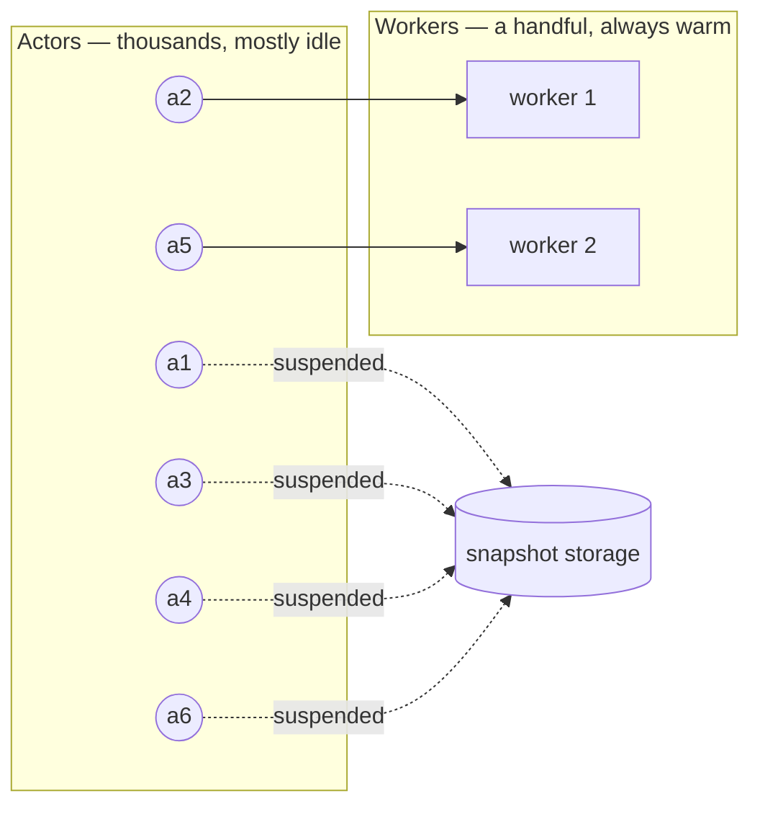
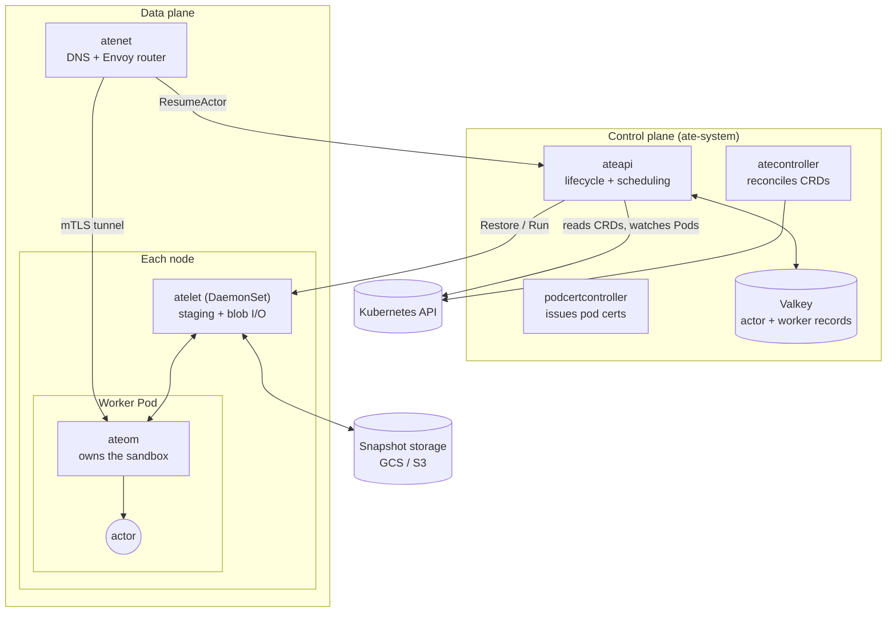
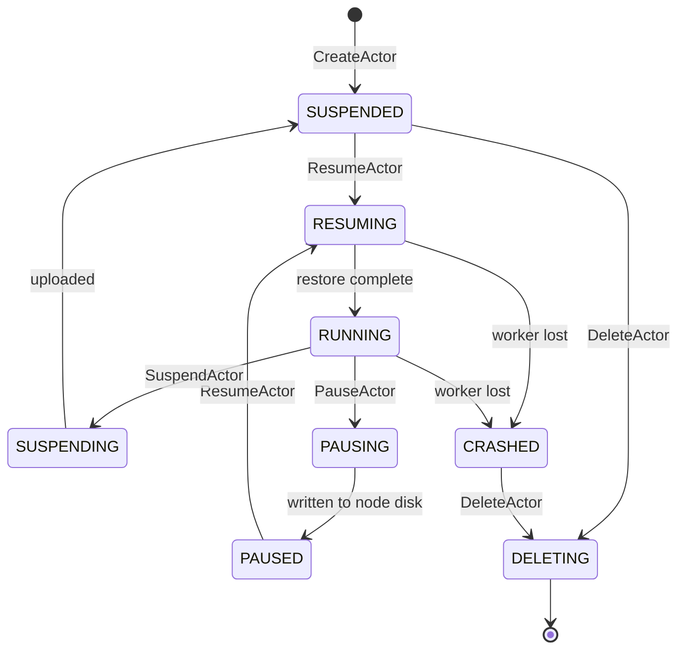

# Agent Substrate Internals

A detailed walkthrough of how Agent Substrate actually works — the components, the
data model, the lifecycle workflows, the request path, the snapshot machinery, and
the identity system.

This document sits one level below [`architecture.md`](architecture.md), which
explains the *why*. Here we explain the *how*, with enough mechanical detail to
navigate the source. Terms used throughout are defined in
[`glossary.md`](glossary.md); the repository layout is described in
[`dev/code-layout.md`](dev/code-layout.md).

> **Scope note.** Everything below describes the code as it exists today, not the
> roadmap. Where a mechanism is deliberately incomplete, that is called out inline.

## Contents

1. [The idea in one page](#1-the-idea-in-one-page)
2. [Vocabulary](#2-vocabulary)
3. [The moving parts](#3-the-moving-parts)
4. [Resource model](#4-resource-model)
5. [Control plane internals](#5-control-plane-internals)
6. [The lifecycle workflows](#6-the-lifecycle-workflows)
7. [The request path](#7-the-request-path)
8. [Networking](#8-networking)
9. [The node layer and sandboxes](#9-the-node-layer-and-sandboxes)
10. [Snapshots and storage](#10-snapshots-and-storage)
11. [Identity and PKI](#11-identity-and-pki)
12. [Configuration reference](#12-configuration-reference)
13. [Deployment topology](#13-deployment-topology)
14. [Development workflow](#14-development-workflow)
15. [Where to look in the code](#15-where-to-look-in-the-code)

---

## 1. The idea in one page

Agent-like workloads are idle almost all the time. They wait for a user, wait for a
model, wait for a tool call — then do a few hundred milliseconds of work and go back
to waiting. Running each one as its own Pod means paying for a full sandbox around a
process that is doing nothing.

Agent Substrate's bet is that you can run **many more agents than you have capacity
for**, provided you can suspend and resume them fast enough that nobody notices. So
it keeps a small pool of pre-warmed sandboxes ("workers") and multiplexes a much
larger population of logical instances ("actors") across them.

Three consequences follow, and they explain most of the design:

**Kubernetes is too slow for the hot path.** Scheduling a Pod takes seconds — fine
for something that runs for hours, unacceptable for something that runs for
milliseconds. So worker Pods are provisioned by Kubernetes ahead of time, and the
actual actor-to-worker assignment is done by a purpose-built control plane in a
single Redis round-trip.

**etcd is the wrong store for actor state.** Millions of actors changing state many
times per second is not what the Kubernetes API server is built for. So the system
splits its API surface by write frequency: slow-moving *configuration* lives in
Kubernetes as CRDs (where it gets RBAC, auditing and admission control for free),
and fast-moving *instance state* lives in Valkey.

**Suspending means moving state, so state must be portable.** An actor suspended on
one node may resume on another. Its memory and filesystem are captured into a
snapshot in object storage, which becomes the unit of portability — and the reason
much of the interesting engineering in this repository is about snapshot formats,
demand paging, and differential capture.



---

## 2. Vocabulary

Six terms carry most of the weight. Full definitions are in
[`glossary.md`](glossary.md).

| Term | What it is |
|---|---|
| **Actor** | One logical instance. The thing that suspends and resumes. |
| **Worker** | One pre-warmed sandbox Pod. Hosts at most one actor at a time. |
| **Atespace** | The namespace an actor lives in. Actors are addressed `(atespace, name)`. |
| **ActorTemplate** | The "class" an actor is instantiated from — image, containers, volumes. |
| **WorkerPool** | Declares warm capacity; becomes a Deployment of worker Pods. |
| **Snapshot** | Captured actor state (memory and/or data) in object storage. |

Two distinctions catch people out:

- An **atespace is not a Kubernetes namespace.** It is a global-scoped record in the
  control-plane store. The namespace an `ActorTemplate` lives in is a separate,
  unrelated thing.
- **Suspend and pause are different operations.** Suspend writes a durable snapshot
  to object storage and fully frees the worker. Pause writes a snapshot to the
  node's local disk and pins the next resume back to that node. Pause is faster;
  suspend is portable.

---

## 3. The moving parts

Six binaries. Three run in the control plane, three in the data plane.



**`ateapi`** — the control plane. Owns the actor lifecycle, assigns actors to
workers, mints actor credentials. Stateless; all state is in Valkey. Reads
`ActorTemplate`, `WorkerPool` and `SandboxConfig` from Kubernetes through informers,
and watches worker Pods to keep its `Worker` records current.

**`atecontroller`** — a standard controller-runtime manager. Turns each `WorkerPool`
into a Deployment plus a NetworkPolicy, and drives each `ActorTemplate` through the
phases that produce its golden snapshot.

**`podcertcontroller`** — a polyfill for the Kubernetes `PodCertificateRequest` API
that has not shipped upstream yet. Every component's TLS identity comes from here.

**`atenet`** — two subcommands. `atenet dns` keeps a CoreDNS instance serving actor
names; `atenet router` runs an Envoy control plane plus the `ext_proc` service that
resumes an actor mid-request.

**`atelet`** — a DaemonSet, one per node, running **unprivileged**. It stages OCI
bundles on disk and moves snapshot blobs to and from object storage. It drops all
capabilities, so it cannot mount anything — that is deliberate, and it is why the
next component exists.

**`ateom`** — runs *inside* each worker Pod and owns everything privileged: mounts,
processes, the sandbox itself. There is one binary per sandbox class,
`ateom-gvisor` and `ateom-microvm`. `atelet` talks to it over a unix socket.

The split between `atelet` and `ateom` is the single most important structural
decision in the node layer: the Pod's lifecycle is decoupled from the sandboxed
process's lifecycle, and the privileged surface is confined to one container.

---

## 4. Resource model

State is split by how often it changes.

### Kubernetes CRDs — configuration

Group `ate.dev/v1alpha1`.

| Kind | Scope | Purpose |
|---|---|---|
| `WorkerPool` | Namespaced | Warm capacity. Has a `/scale` subresource so a stock HPA can drive it. |
| `ActorTemplate` | Namespaced | The workload blueprint. Spec is **immutable**, enforced by CEL. |
| `SandboxConfig` | Cluster | Content-addressed sandbox binaries (`runsc`, micro-VM kernel/firmware). |

Because `ActorTemplate` is immutable, "upgrading" an actor version means creating a
new template. That is intentional: a template's identity is pinned into every
snapshot produced from it.

<details>
<summary><b>WorkerPool — field reference</b></summary>

| Field | Type | Default | Meaning |
|---|---|---|---|
| `spec.replicas` | int32 | required | Worker pods to run. Min 0. |
| `spec.ateomImage` | string | required | The ateom image to deploy as workers. |
| `spec.sandboxClass` | enum | `gvisor` | `gvisor` or `microvm`. Drives pod shape and eligible configs. |
| `spec.sandboxConfigName` | string | — | Overrides the cluster default `SandboxConfig` for this class. |
| `spec.terminationGracePeriodSeconds` | *int32 | `300` | ateom traps SIGTERM and forwards it so the actor can save state. |
| `spec.template.nodeSelector` | map | — | Worker pod node selection. |
| `spec.template.tolerations` | list | — | Max 16. |
| `spec.template.priorityClassName` | string | — | |
| `spec.template.nodeAffinity` | object | — | Mapped to `spec.affinity.nodeAffinity`. |
| `spec.template.resources` | object | — | Compute resources per worker pod. |
| `status.replicas` | int32 | — | Total worker pods. Feeds the HPA. |
| `status.selector` | string | — | Label selector, feeds the `/scale` subresource. |

</details>

<details>
<summary><b>ActorTemplate — field reference</b></summary>

| Field | Type | Meaning |
|---|---|---|
| `spec.containers[]` | list | The workload. See below. |
| `spec.pauseImage` | string | Pause container image. Must be digest-pinned. |
| `spec.snapshotsConfig.location` | string | Storage URI prefix for snapshots. Required. |
| `spec.snapshotsConfig.onPause` | enum | `Full` or `Data` — what a Pause captures. |
| `spec.snapshotsConfig.onCommit` | enum | What a Suspend captures. Must be a subset of `onPause`. |
| `spec.snapshotsConfig.onResume.fromData` | enum | `ColdBoot` (default) or `Golden`. |
| `spec.sandboxClass` | enum | `gvisor` (default) or `microvm`. |
| `spec.workerSelector` | LabelSelector | Constrains which pools may host actors of this template. |
| `spec.volumes[]` | list | `durableDir` or `externalVolumeTemplate` sources. |
| `status.phase` | enum | `ResumeGoldenActor` → `WaitGoldenActor` → `Ready`. |
| `status.goldenActorID` | string | The temporary actor used to produce the golden snapshot. |
| `status.goldenSnapshot` | string | The resulting golden snapshot name. |

Per container: `name`, `image` (digest-pinned), `command`, `args`, `env[]`
(literal `value` or `valueFrom.secretKeyRef`), `readyz.httpGet{path,port}`, and
`volumeMounts[]{name, mountPath}`.

</details>

<details>
<summary><b>CEL validation rules</b></summary>

All validation is CEL on the CRD plus one `ValidatingAdmissionPolicy`. **There are
no admission webhooks.** The rules worth knowing:

- **The whole spec is immutable**: `self == oldSelf`.
- **Images must be digest-pinned**: `self.contains('@')`, on both container images
  and the pause image — because changing an image invalidates every snapshot.
- **Mount paths must be clean absolute Unix paths**: no `..`, no `//`, no `:`, no
  trailing slash, no control characters.
- **`onCommit` must be a subset of `onPause`** — you cannot durably commit more than
  you captured.
- **Every declared volume must be mounted** by at least one container.
- **gVisor-only limits**: at most one `DurableDir` volume per template *and* per
  container; `onResume.fromData: Golden` is rejected. All three are lifted for
  `microvm`.
- **`microvm`-only limit**: external volumes are not supported.
- Names are DNS-1123 labels; secret references are DNS-1123 subdomains.

The cluster-scoped `ValidatingAdmissionPolicy` (fail-closed) enforces required
sandbox asset names per class — `runsc` for gVisor; `cloud-hypervisor`,
`virtiofsd`, `kata-kernel`, `kata-image` and `kata-config` for micro-VM.

</details>

### Control-plane records — instance state

Stored in Valkey as `protojson`, not in etcd.

| Record | Key identity | Notes |
|---|---|---|
| `Atespace` | `name` (global) | Must exist before actors; deletable only when empty. |
| `Actor` | `(atespace, name)` | Status, worker pointers, snapshot references. |
| `Worker` | `(namespace, pool, pod)` | One assignment slot. |
| `ActorSnapshot` | `(atespace, name)` | Immutable record of a captured snapshot. |
| `ActorSnapshotTag` | `(atespace, name)` | Named alias and retention pin for a snapshot. |

Every record except `Worker` carries a common `ResourceMetadata`:

```protobuf
message ResourceMetadata {
  string atespace = 1;    // owning namespace; empty for global-scoped
  string name     = 2;    // unique within the atespace
  string uid      = 3;    // server-assigned UUIDv4, immutable
  int64  version  = 4;    // bumped on every write — the concurrency token
  google.protobuf.Timestamp create_time = 5;
  google.protobuf.Timestamp update_time = 6;
}
```

`Worker` is the exception: it carries a bare top-level `version` field instead, so
its optimistic-concurrency token is `worker.version`, not `worker.metadata.version`.

### The Actor record

The fields that matter for understanding the lifecycle:

| Field | Meaning |
|---|---|
| `status` | Where in the lifecycle this actor is (see below). |
| `actor_template_namespace` / `_name` | Which template it came from. Immutable. |
| `ateom_pod_namespace` / `_name` / `_ip` / `_uid` | The assigned worker Pod. Empty when unassigned. |
| `worker_pool_name` | Pool owning the assigned worker. Cleared when freed. |
| `latest_snapshot` | The most recent durable snapshot. |
| `local_snapshot_info` | Node-local snapshot prefix + which nodes hold it. Used while `PAUSED`. |
| `in_progress_snapshot` | URI of a checkpoint currently being written. |
| `worker_selector` | Per-actor placement constraint, AND-ed with the template's. |
| `actor_volumes` | External volumes whose lifetime is the actor's. |

The pod UID is carried alongside the pod name so that `atelet` can reject a request
aimed at a Pod that has since been replaced.

### Actor status

Nine enum values, eight of them real states.



| Status | Holds a worker? | Meaning |
|---|---|---|
| `SUSPENDED` | No | State is a durable snapshot. Creation state. |
| `RESUMING` | Yes | Worker assigned, restore in flight. |
| `RUNNING` | Yes | Live and serving. |
| `SUSPENDING` | Yes | Durable checkpoint being uploaded. |
| `PAUSING` | Yes | Node-local checkpoint in flight. |
| `PAUSED` | No | State is on a specific node's disk. |
| `CRASHED` | No | Unrecoverable; worker released. Deletable. |
| `DELETING` | No | Delete in progress. Only state the store will `DEL` from. |

An actor is created `SUSPENDED` pointing at its template's golden snapshot, so its
first resume is a restore rather than a cold boot.

---

## 5. Control plane internals

### 5.1 API surface

Three gRPC services in `pkg/proto/ateapipb/ateapi.proto`, 21 methods total.

<details>
<summary><b>Control — 18 methods</b></summary>

| Method | Request → Response |
|---|---|
| `CreateActor` | `CreateActorRequest` → `Actor` |
| `GetActor` | `GetActorRequest` → `Actor` |
| `ListActors` | `ListActorsRequest` → `ListActorsResponse` |
| `UpdateActor` | `UpdateActorRequest` → `UpdateActorResponse` |
| `DeleteActor` | `DeleteActorRequest` → `Actor` |
| `ResumeActor` | `ResumeActorRequest` → `ResumeActorResponse` |
| `SuspendActor` | `SuspendActorRequest` → `SuspendActorResponse` |
| `PauseActor` | `PauseActorRequest` → `PauseActorResponse` |
| `CreateAtespace` | `CreateAtespaceRequest` → `Atespace` |
| `GetAtespace` | `GetAtespaceRequest` → `Atespace` |
| `ListAtespaces` | `ListAtespacesRequest` → `ListAtespacesResponse` |
| `DeleteAtespace` | `DeleteAtespaceRequest` → `Atespace` |
| `GetActorSnapshot` | `GetActorSnapshotRequest` → `ActorSnapshot` |
| `ListActorSnapshots` | `ListActorSnapshotsRequest` → `ListActorSnapshotsResponse` |
| `TagActorSnapshot` | `TagActorSnapshotRequest` → `ActorSnapshotTag` |
| `UpdateActorSnapshotTag` | `UpdateActorSnapshotTagRequest` → `ActorSnapshotTag` |
| `DeleteActorSnapshotTag` | `DeleteActorSnapshotTagRequest` → `ActorSnapshotTag` |
| `ListWorkers` | `ListWorkersRequest` → `ListWorkersResponse` |

</details>

`ActorIdentity` provides `MintJWT` and `MintCert` (see
[Identity and PKI](#11-identity-and-pki)). `Debug` provides `DebugClear`, which
flushes the entire control-plane database — it is registered unconditionally, so
treat it accordingly.

Two request fields worth knowing:

- `ResumeActorRequest.boot = true` skips the golden snapshot and cold-boots.
- `ResumeActorResponse.resumed` is `false` when the actor was already `RUNNING`,
  which is how the router distinguishes a real resume from a no-op.

**Addressing.** Most methods take an `ObjectRef { atespace, name }`. Snapshot
methods take an `ActorSnapshotRef`, which is a oneof over a direct reference or a
tag. Actor and atespace names must be DNS-1123 labels.

**Pagination** is cursor-based and cluster-aware. Page size defaults to *and* caps
at 1000. The page token is base64 of `{shard_hash, cursor}` — a SHA-256 of the
Redis master's address plus that shard's SCAN cursor. Masters are sorted by address
so the traversal order is stable. Because SCAN is a live traversal, listing gives
soft guarantees: concurrent writes can cause a record to be missed or duplicated,
and a page may come back slightly short.

### 5.2 Storage layout

Everything is a `protojson` string under a flat key.

```
actor:<atespace>:<name>
worker:<namespace>:<pool>:<pod>
atespace:<name>
actor-snapshot:<atespace>:<name>
actor-snapshot-tag:<atespace>:<name>
```

The `actor:` format is explicitly frozen — a comment in the source notes that
existing databases hold keys in this form and it must not change.

`ActorSnapshot` is the one record that is not stored as a bare proto. It is wrapped
so the physical storage location can travel with it without appearing in the API:

```go
type dbActorSnapshot struct {
    Snapshot json.RawMessage `json:"snapshot"` // the ActorSnapshot proto
    Location string          `json:"location"` // storage URI, never returned to clients
}
```

No record key carries a TTL. The only TTL in the store is on locks.

**Optimistic concurrency.** Creates use `SETNX`. Updates use `WATCH` + `MULTI/EXEC`:
read the current record, compare its `version` against the caller's expected
version, reject with `ErrVersionConflict` on mismatch, then write with a
server-derived version bump. A racing writer that breaks the `WATCH` surfaces as the
same conflict error. Immutable fields (`name`, `atespace`, template pointers, and
for workers the pod identity and IP) are re-checked on every update.

**A structural constraint worth internalising:** in Redis Cluster a transaction
cannot span hash slots. `actor:…` and `worker:…` hash differently, so it is
*impossible* to atomically mark an actor scheduled and its worker busy. The code
compensates by ordering the writes deliberately — claim the worker first, then the
actor — and relying on per-key compare-and-swap. This is documented at the top of
the store package, and it explains several otherwise-odd sequences.

**Locks.** Per-object locks serialise the workflows:

```
lock:actor:<atespace>:<name>
lock:atespace:<name>
lock:actor-snapshot:<atespace>:<name>
```

A lock is `SETNX key <uuid> EX 30`. Failure is immediate — there is no queueing —
and surfaces to the client as gRPC `Aborted`. A background goroutine renews the
lease every 10s (TTL/3), retries every 3s on failure (TTL/10), and gives up if 20s
pass without a successful renewal (2/3 of TTL), at which point it cancels the
workflow's context. Renew and release are Lua scripts that compare the stored UUID
first, so a holder can never renew or release a lock it has already lost.

**Worker events.** A single pub/sub channel, `worker-changes`, carries
`{t: <0=created|1=updated|2=deleted>, w: <protojson Worker>}`. Delete events carry a
partial record with only namespace and pod name — exactly the cache key. Publishing
is fire-and-forget: failures are logged, never returned. Subscribers get a
128-buffered channel, and `WatchWorkers` blocks up to 5s for the SUBSCRIBE
confirmation before returning, so no event published after the call returns is lost.

### 5.3 The workflow engine

Every state-changing operation is a list of steps:

```go
type WorkflowStep[Params, Context any] interface {
    Name() string
    IsComplete(ctx, params, wCtx) (bool, error)
    CheckPrerequisite(ctx, params, wCtx) error
    Execute(ctx, params, wCtx) error
    RetryBackoff() *wait.Backoff
}
```

The runner walks the steps in order. For each: if `IsComplete` returns true it
**fast-forwards without calling `CheckPrerequisite`** — that is what lets a retried
workflow skip work it has already done without re-validating a state-machine edge it
has already crossed. Otherwise it checks the prerequisite (a failure here is
`FailedPrecondition` and aborts) and executes.

There is **no rollback or compensation**. The model is *client-driven forward
recovery*: every step is idempotent, every completion test reads persisted state
rather than in-memory bookkeeping, and a crashed workflow is resumed by the client
retrying the same call. Only one step in the whole system sets a retry backoff —
worker assignment — and it retries solely on version conflicts.

All four workflows take the per-actor lock first and run under the lock's context,
so losing the lease cancels the work in flight.

### 5.4 Scheduling

Worker selection is a filter-then-pick over an in-memory cache. The predicates, in
short-circuit order:

1. The worker is **free** (`assignment == nil`).
2. Its **sandbox class** matches the template's (`gvisor` or `microvm`).
3. Its **state** is `ACTIVE` (not `DRAINING`).
4. The **template's** label selector matches — full Kubernetes semantics, including
   `matchExpressions`.
5. The **actor's** label selector matches — equality-only.
6. If the actor is `PAUSED`, the worker's node is in the actor's **required nodes**.

Survivors are picked from **uniformly at random**. There is no scoring, bin-packing,
spread, or locality preference beyond the pause pinning. No survivors gives
`ErrNoCapacity`, which the caller turns into `FailedPrecondition: no free workers
available` — the signal the router's parking lot waits on.

An important subtlety: the labels being matched are the **WorkerPool's** Kubernetes
labels, copied onto each `Worker` record by the syncer. Both selectors therefore
effectively select *pools*, not individual pods.

**The worker cache** is a single map keyed `<namespace>:<pod>` — note it drops the
pool name that the Redis key carries. It subscribes to `worker-changes` *before*
doing its initial list, so no event is missed, and applies updates only when the
incoming version is at least the cached one. A full relist runs every 5 minutes as
drift recovery, and a dropped subscription triggers a backoff resync.

### 5.5 The worker syncer

`Worker` records are derived from Kubernetes Pods, not created by users. A shared
informer watches Pods cluster-wide filtered on the existence of the
`ate.dev/worker-pool` label, with a 5-minute resync.

**On add or update:**

1. If the Pod has a `DeletionTimestamp`, mark the worker `DRAINING` and **stop**.
   This check comes first deliberately — a terminating Pod can legitimately report
   no IP once its sandbox is torn down, so checking IP first would drop the
   transition and leave a dying worker schedulable.
2. Skip if the Pod has no IP yet.
3. If no record exists, create one from the Pod and its `WorkerPool` — copying the
   pool's sandbox class and Kubernetes labels onto the record.
4. If one exists, reconcile exactly three fields: IP, sandbox class, labels.

**On delete:** release the bound actor first, and only delete the `Worker` record if
that succeeded — deleting the record is what erases the actor's pointer back to the
Pod, so on failure the record is deliberately left for a later reconcile.

**At startup:** replay every indexed Pod, then scan all stored workers and reconcile
any whose Pod is gone *or present under a different UID*. This is the only mechanism
that recovers delete events missed while the process was down.

Releasing an actor on a dead worker sets it `CRASHED` and clears its pod pointers —
but it no-ops if the actor already reached `SUSPENDED`, because that means it
checkpointed cleanly during graceful termination and is still resumable.

---

## 6. The lifecycle workflows

Four workflows, twenty step types. Each is a list of idempotent steps run under the
per-actor lock.

### 6.1 Resume — 6 steps

The hot path. Takes a `SUSPENDED` or `PAUSED` actor and makes it live.

| # | Step | What it does |
|---|---|---|
| 1 | `LoadActorForResume` | Load actor + template. Resolve which snapshot to restore from and at what scope. |
| 2 | `CreateVolumes` | Provision any external volumes still `PENDING`. |
| 3 | `AssignWorker` | Pick a worker, claim it, point the actor at it. |
| 4 | `AttachVolumes` | Attach the actor's volumes to the chosen node. |
| 5 | `CallAteletRestore` | Tell `atelet` to restore (or cold-boot) the workload. |
| 6 | `FinalizeRunning` | Flip the actor to `RUNNING`. |

**Snapshot resolution** (step 1) is the interesting part. In order of preference:
the actor's own `latest_snapshot`; failing that, the template's golden snapshot —
unless `boot: true` was requested, which forces a cold start. When the pending
restore is data-only *and* the template sets `onResume.fromData: Golden`, a second
location is resolved too, so the restore can combine the golden's warm guest state
with this actor's own durable data.

Step 1 also handles a re-entrant resume: if the actor is *already* `RESUMING`, it
reloads the previously assigned worker and crashes the actor if that worker has
vanished, is corrupt, or has gone `DRAINING`.

**Worker assignment** (step 3) is where the cross-slot constraint shows up. It
first tries to reclaim a worker already assigned to this actor from a crashed
earlier attempt. Otherwise it calls the scheduler, then writes the assignment onto
the *worker* first and only then flips the actor to `RESUMING` with the pod
pointers. This is the only step with a retry backoff — 5 attempts starting at 10ms,
doubling, fully jittered — and it retries only on version conflicts.

**The restore call** (step 5) re-validates that the worker still belongs to this
actor before dialling, then issues one of three things to `atelet`: a `LOCAL`
restore from node-local state (resuming a paused actor), an `EXTERNAL` restore from
object storage, or a `Run` for a cold boot.

### 6.2 Suspend — 5 steps

Captures a durable snapshot and frees the worker.

| # | Step | What it does |
|---|---|---|
| 1 | `LoadActorForSuspend` | Load actor + template; record the source version. |
| 2 | `MarkSuspending` | Set `SUSPENDING`; mint the snapshot URI. |
| 3 | `CallAteletSuspend` | `Checkpoint` with type `EXTERNAL` at the configured scope. |
| 4 | `DetachVolumes` | Detach volumes from the node. |
| 5 | `FinalizeSuspended` | Free the worker, create the `ActorSnapshot`, set `SUSPENDED`. |

The snapshot URI is minted as
`<template.snapshotsConfig.location>/snapshots/<RFC3339>-<random>`, recorded on the
actor as `in_progress_snapshot` before any work starts. That is what makes a retry
land on the same object rather than orphaning the first attempt.

The captured scope comes from the template's `onCommit` setting — except for actors
in the reserved golden atespace, which always commit `Full`, since a golden snapshot
must carry everything.

Finalisation frees the worker **only if its assignment still points at this actor**,
then creates the immutable `ActorSnapshot` record, repoints `latest_snapshot`, and
clears the pod pointers, pool name, local snapshot info and `in_progress_snapshot`.

### 6.3 Pause — 5 steps

The same shape as suspend, but the snapshot stays on the node.

| # | Step | What it does |
|---|---|---|
| 1 | `LoadActorForPause` | Load actor + template. |
| 2 | `MarkPausing` | Set `PAUSING`; mint a node-local prefix. |
| 3 | `CallAteletPause` | `Checkpoint` with type `LOCAL` at the `onPause` scope. |
| 4 | `DetachVolumesForPause` | Detach volumes. |
| 5 | `FinalizePaused` | Free the worker, record which node holds the snapshot, set `PAUSED`. |

The critical detail is in step 5: it records
`local_snapshot_info{snapshot_prefix, node_vms_with_local_snapshots: [node]}`, and
that node list becomes the scheduler's `RequiredNodes` on the next resume — which is
how a paused actor gets pinned back to the node holding its state.

If the node name cannot be determined, the actor is set **`CRASHED` rather than
`PAUSED`**, because without knowing where the snapshot lives it could never be
scheduled back.

### 6.4 Delete — 4 steps

| # | Step | What it does |
|---|---|---|
| 1 | `LoadActorForDelete` | Load the actor; missing → `NotFound`. |
| 2 | `MarkDeleting` | Require `SUSPENDED`, `CRASHED` or already `DELETING`; set `DELETING`. |
| 3 | `DeleteVolumes` | Delete external volumes from the storage system. |
| 4 | `FinalizeDeleted` | `DEL` the record — the store re-checks `DELETING` under `WATCH` first. |

Step 3's `IsComplete` always returns false, so it re-runs on every retry — deleting
volumes is naturally idempotent and cheap to repeat.

Note what deletion does *not* do: it does not remove the actor's snapshots from
object storage. Snapshot garbage collection is not implemented.

### 6.5 Crashing

When an `atelet` call returns an error carrying the `actorCrashed=true` metadata
directive, the control plane crashes the actor and returns gRPC `DataLoss`. Crashing
releases the worker (again, only if the assignment still points at this actor), sets
`CRASHED`, and clears the pod pointers and pool name — but deliberately **keeps
`in_progress_snapshot`** for debugging, since a failed checkpoint must never be
promoted into a real `ActorSnapshot`.

---

## 7. The request path

This is the path the whole system exists to make fast. Everything below happens
while the client's HTTP request is held open.

```mermaid
sequenceDiagram
    participant C as Client
    participant D as CoreDNS
    participant E as Envoy
    participant R as router (ext_proc)
    participant A as ateapi
    participant L as atelet
    participant T as ateom / atunnel

    C->>D: resolve my-actor.demo.actors…
    D-->>C: atenet-router ClusterIP
    C->>E: GET / (Host: my-actor.demo.actors…)
    E->>R: ext_proc RequestHeaders
    R->>R: parse actor from Host; enter parking lot
    R->>A: ResumeActor(demo/my-actor)
    A->>L: Restore (mTLS)
    L->>L: pull snapshot, decompress, stage
    L->>T: RestoreWorkload
    T-->>L: ready
    A-->>R: worker pod IP
    R-->>E: set x-ate-original-dst: <ip>:443
    E->>T: mTLS to worker :443 (ORIGINAL_DST)
    T->>T: check Host matches active actor
    T-->>E: proxied response
    E-->>C: response
```

**1 — DNS.** The client resolves
`<actor>.<atespace>.actors.resources.substrate.ate.dev`. Note this is *not*
per-actor DNS: CoreDNS serves a single wildcard template that answers every
well-formed actor name with the **router's ClusterIP**, TTL 60. Real resolution
happens later.

**2 — Envoy.** The request hits the ingress listener (`:8080` plaintext, `:8443`
TLS). Envoy does no host-based routing at all — there is exactly one virtual host
matching `*` and one route matching prefix `/`. Everything interesting is delegated
to the external processor.

**3 — ext_proc.** Envoy sends only the request headers to the router over gRPC
(`RequestHeaderMode: SEND`; bodies, trailers and responses are all `SKIP`/`NONE`, so
payloads never leave Envoy). The router then:

- Lowercases the headers and pulls `host` from `:authority` (or `host`).
- Extracts W3C trace context from the *HTTP* headers, because Envoy does not
  propagate trace context into the ext_proc gRPC metadata.
- Parses the actor reference out of the host: strip any port, require the exact DNS
  suffix, split the remainder on the first dot into `(actor, atespace)`, and
  validate both as DNS-1123 labels. A bad host is a **404 before any control-plane
  call**.
- Admits the request to the parking lot (below). A full lot sheds immediately
  with 503.
- Calls `ResumeActor`.

**4 — Resume.** See [the resume workflow](#61-resume--6-steps). The control plane
claims a worker, has `atelet` restore the snapshot into it, and returns the worker's
pod IP.

**5 — The mutation.** The router validates the returned IP parses, then returns a
header mutation setting `x-ate-original-dst: <workerIP>:443`. Crucially it does
**not** rewrite `:authority` — the original actor hostname must survive, because
that is what `atunnel` authorizes on at the far end.

**6 — Dialing the worker.** Envoy's `actor_original_dst` cluster is an
`ORIGINAL_DST` cluster configured with `use_http_header: true` and
`http_header_name: x-ate-original-dst`, so it dials exactly that address over mTLS.

**7 — atunnel.** The worker's ingress server verifies the client certificate,
requires its SPIFFE ID to equal the router's exactly, re-parses the `Host` header,
and compares it against the actor currently activated on that worker. A mismatch is
**HTTP 421** with an `X-Ate-Assignment-Stale: true` header. On a match it reverse-
proxies to the actor over the private veth at `169.254.17.2:80`, preserving `Host`
so the application sees its stable mesh name.

### Latency-relevant timeouts on this path

| Stage | Timeout | Configurable |
|---|---|---|
| Envoy → ext_proc connect | 250ms | no |
| ext_proc message timeout | 5s, or park budget + 5s | via park budget |
| Envoy route timeout | **10s** | no |
| Envoy → worker connect | 5s | no |
| Park budget | 5s | `--parked-request-budget` |
| Resume budget, parking off | 15s | no |

The 10s route timeout is a hard ceiling on any single actor request, and there is no
flag for it. The HCM also configures no upgrade support or stream idle timeout, so
websockets and SSE do not currently work through the router even though `atunnel`
handles them correctly.

### Error mapping

The router translates resume failures into HTTP deliberately:

| Cause | HTTP |
|---|---|
| Invalid host | 404 |
| Actor not found | 404 |
| Parking lot full / no capacity | 503 |
| Lock conflict (`Aborted`) | 503 |
| Client disconnected | 408 |
| Deadline exceeded | 504 |
| Permission denied / unauthenticated | 403 / 401 |
| Resource exhausted | 429 |
| Anything else | 500 (generic body) |

`FailedPrecondition` and `Aborted` deliberately preserve the gRPC description in the
body because those messages are actionable ("no free workers available"); everything
unrecognised collapses to a generic 500 so server internals do not leak.

---

## 8. Networking

### 8.1 DNS

The `dns` Deployment runs three things in one Pod with **`shareProcessNamespace:
true`**: an init container that writes a bootstrap Corefile, CoreDNS itself, and the
`atenet dns` controller as a sidecar.

The controller reconciles every 10s:

1. Read the `atenet-router` Service ClusterIP.
2. Render the Corefile and, **if the bytes differ**, write it and signal CoreDNS.
3. Read the `dns` Service ClusterIP and inject a `stubDomains` entry into the
   `kube-dns` ConfigMap in `kube-system`, so ordinary cluster Pods can resolve actor
   names too. If that ConfigMap does not exist (non-GKE), it logs and moves on.

The generated Corefile is one zone block with a single wildcard template:

```
actors.resources.substrate.ate.dev:53 {
  log
  errors
  health :8080
  ready :8181
  reload
  template IN A actors.resources.substrate.ate.dev {
    match "^<label>\.<label>\.actors\.resources\.substrate\.ate\.dev\.$"
    answer "{{ .Name }} 60 IN A <router ClusterIP>"
  }
}
```

Both `<label>` positions are the DNS-1123 pattern
`[a-z0-9]([-a-z0-9]*[a-z0-9])?`, so a name with the wrong shape simply gets no
answer.

**Reload works by signal, not restart:** the controller scans `/proc/*/comm` for a
process named `coredns` and sends it `SIGUSR1`. That only works because the Pod
shares a process namespace. If the PID cannot be found the error is logged and
swallowed rather than failing the reconcile. CoreDNS's own `reload` plugin is also
enabled as a belt-and-braces fallback.

### 8.2 The Envoy control plane

The router serves xDS over ADS to an Envoy sidecar in the same Pod. Envoy's static
bootstrap points at `127.0.0.1:18000` and identifies itself as node
`substrate-envoy-node` — the single key the snapshot is published under. The whole
snapshot is rebuilt and re-versioned on every 5s reconcile and validated with
`snapshot.Consistent()` before publishing.

**Clusters:**

| Name | Type | Connect timeout | Notes |
|---|---|---|---|
| `ate-cluster` | STATIC | 250ms | the ext_proc endpoint; HTTP/2; carries the circuit breaker |
| `actor_original_dst` | ORIGINAL_DST | 5s | dials workers; HTTP/1.1 when mTLS is on |
| `otel_collector_cluster` | STRICT_DNS | 1s | only present when a collector is configured |

**Listeners:** `ingress_http_listener` on `:8080`, and `ingress_https_listener` on
`:8443` when a cert path is configured. The HTTPS chain gets its certificate over
SDS, with `WatchedDirectory` set so kubelet's rotation is picked up. Both the cert
and key point at the *same* file, because a pod-certificate credential bundle is a
single PEM holding both.

**Upstream mTLS** is attached only to the worker cluster. It presents the router's
pod-identity bundle and validates the server by **SPIFFE URI SAN prefix** — default
`spiffe://cluster.local/` — rather than by hostname, because the worker's
certificate carries no IP SAN and the dialed address is an ephemeral pod IP.

### 8.3 Request parking

When the pool is momentarily saturated the control plane returns
`FailedPrecondition: no free workers available`. Rather than turning that into an
immediate 503, the router **parks** the request and keeps retrying.

| Setting | Flag | Default |
|---|---|---|
| Budget | `--parked-request-budget` | 5s |
| Capacity | `--parked-request-max` | 1024 |
| Retry interval | `--parked-request-retry-interval` | 100ms |
| Retry factor | `--parked-request-retry-factor` | 1.1 |
| Retry jitter | `--parked-request-retry-jitter` | 0.1 |

There is no on/off flag — `--parked-request-max=0` disables parking, which switches
the resumer to a fail-fast 15s budget instead.

Three design details are worth understanding:

**The lot is a load-shedding gate, not a queue.** Admission is a non-blocking
counter check. When it is full the request is rejected immediately with 503 rather
than queued, so the router sheds rather than growing without bound.

**The budget is per-flight, not per-request.** Concurrent requests for the same
actor collapse into one `singleflight` call, and that flight runs on a *detached*
background context so one client disconnecting does not abort the resume the others
are waiting on. The consequence — documented in
[`request-parking.md`](request-parking.md) — is that a late joiner can see
`budget_exhausted` after waiting much less than a full budget.

**The lot is sized against Envoy's circuit breaker.** Each parked request holds one
ext_proc stream for its entire wait, so the `ate-cluster` `max_requests` breaker
must be at least the lot size. It defaults to `2 × parked-request-max` (floored at
1024), and startup validation rejects an explicit value below the lot size. The
ext_proc message timeout is likewise raised to `budget + 5s` so Envoy does not
abandon a stream the router still owns.

Retry classification matters too: `Aborted` (lock conflict) is always retried, while
`FailedPrecondition` and `Unavailable` are retried **only when parking is enabled**.
The backoff deliberately sets no cap, because Go's `wait.Backoff` zeroes its step
count once the delay reaches the cap, which would end retries long before the budget.

### 8.4 atunnel

`atunnel` runs inside the worker Pod, hosted by `ateom`, and has two independent
halves.

**Ingress** — an HTTPS reverse proxy on `0.0.0.0:443`:

- `RequireAndVerifyClientCert` against the pod-identity trust bundle.
- A `VerifyConnection` callback requiring an **exact** URI SAN match against
  `--atunnel-client-identity`, default
  `spiffe://cluster.local/ns/ate-system/sa/atenet-router`. This is a single-value
  allowlist, not a prefix.
- The server certificate is re-read from disk on every new TLS connection, so
  rotation takes effect without a restart.
- The `Host` header is re-parsed and compared against the actor currently activated
  on this worker; a mismatch is 421 with `X-Ate-Assignment-Stale: true`, so callers
  can distinguish a routing rejection from the application's own 421.
- On a match it proxies to `http://169.254.17.2:80` preserving `Host`.

Activation is exclusive — one actor per worker — and deactivation cancels the
activation context, which cancels every in-flight request, then waits for handlers
to drain.

**Egress** — a transparent-interception listener on `0.0.0.0:15001`. nftables
redirects the actor's outbound TCP to it; it recovers the original destination via
`SO_ORIGINAL_DST`, then opens an HTTP `CONNECT` tunnel to an egress gateway over
mTLS, tagging the request with `X-Ate-Atespace`, `X-Ate-Actor-Name` and
`X-Ate-Actor-Version`. Destinations must be a literal `IP:port` — names are refused.

---

## 9. The node layer and sandboxes

### 9.1 The privilege split

This is the structural idea worth internalising before reading any of the code.

**`atelet`** runs as a DaemonSet with `capabilities.drop: [ALL]`. It cannot mount
anything. Its jobs are: pull and unpack OCI images, assemble bundle directories,
write OCI specs, fetch sandbox binaries, and move snapshot blobs to and from object
storage.

**`ateom`** runs inside the worker Pod and does everything privileged: the overlay
mount, the network namespace, the sandbox process itself.

So the handoff is: *atelet creates empty directories and a JSON spec; ateom performs
the mount.* Nothing else about the node layer makes sense without that.

They talk over a unix socket at
`/var/lib/ateom-gvisor/ateoms/<podUID>/ateom.sock`. The control plane talks to
`atelet` over mTLS on host port 8085.

The two protos are deliberately different shapes. `ateletpb.AteomHerder` has
`Run` / `Checkpoint` / `Restore` and carries object-storage URIs and sandbox assets.
`ateompb.Ateom` has `RunWorkload` / `CheckpointWorkload` / `RestoreWorkload` and
carries only local paths — by the time ateom is involved, atelet has already
materialised everything on disk.

`ateom` is documented as a two-state machine: **available** (accepts `RunWorkload`
or `RestoreWorkload`) and **executing** (accepts `CheckpointWorkload`). There is no
delete RPC — teardown happens inside checkpoint, and filesystem cleanup is atelet's
job.

### 9.2 On-disk layout

Everything lives under `/var/lib/ateom-gvisor` — used by **both** runtimes despite
the name. It is a hostPath mounted identically into `atelet` and every `ateom` Pod.

```
/var/lib/ateom-gvisor/
├── static-files/runsc-<sha256>      every sandbox binary, content-addressed
├── image-cache/
│   ├── layers/sha256/<diffID>/fs/   unpacked layer trees, shared node-wide
│   └── manifests/sha256/<hex>.json
├── ateoms/<podUID>/ateom.sock
└── actors/<actorUID>/
    ├── sandbox-assets.json          PRESERVED — pinned asset set
    ├── bundles/<container>/         wiped — config.json, rootfs, upper, work
    ├── runsc-state/                 wiped — runsc --root
    ├── checkpoint-state/            wiped — ateom writes snapshots here
    ├── restore-state/               wiped — atelet stages snapshots here
    ├── identity/actor-id            wiped — bind-mounted at /run/ate
    ├── durable-dir/<volume>/        wiped — durable volume roots
    ├── volumes/<volume>/            entries removed individually
    └── local-checkpoint/<prefix>/   PRESERVED — pause checkpoints
```

Note every sandbox binary lands at `static-files/runsc-<sha>` — a micro-VM kernel
included. The name is historical; the mechanism is generic content addressing.

**`resetActorDirs`** runs at the start of Run and Restore and at the *end* of
Checkpoint. Three details are deliberate:

- `bundles/` uses `RemoveAllWritable`, not `os.RemoveAll` — the overlay upper can
  hold copied-up image directories that kept the image's read-only modes, and
  atelet has no `CAP_DAC_OVERRIDE` to delete them without chmod'ing first.
- `volumes/` is **not** `RemoveAll`'d. Entries are removed individually so a failed
  unmount surfaces as an error rather than deleting mount contents.
- `sandbox-assets.json` and `local-checkpoint/` are skipped. The former lives
  directly under the actor path rather than in a subdirectory precisely so the reset
  cannot catch it.

**Why checkpoint and restore have separate directories:** `runsc restore -direct
-background` starts executing immediately and demand-pages the image for the
process's lifetime. Writing the next checkpoint to a *different* path sidesteps
having to know when background reading finished.

### 9.3 The gVisor path

`runsc` is invoked seven ways, always with `-log-format json --alsologtostderr
-root <per-actor state dir>`:

| Operation | Command |
|---|---|
| create | `create -bundle <bundle>/<ctr> -pid-file <pid> <ctr>` |
| start | `-allow-connected-on-save start <ctr>` |
| checkpoint | `checkpoint -image-path <checkpoint-state> <ctr>` |
| fscheckpoint | `fscheckpoint -image-path <dir> -path <mount>… <ctr>` |
| restore | `restore -bundle … -image-path <restore-state> -background -direct -detach <ctr>` |
| delete | `delete -force <ctr>` |
| state | `state <ctr>` |

`--platform`, `--network`, `--directfs`, `--overlay2` and friends are never passed,
so runsc runs at its compiled-in defaults. `-allow-connected-on-save` is passed only
on `start`, and works around a gVisor bug with connected sockets at save time.

**The pause-container model.** The pause container is the *sandbox root*: it carries
the CRI annotation `container-type: sandbox`, and every application container
carries `container-type: container` plus `sandbox-id: pause`. runsc therefore boots
one sentry for the pause container and joins the app containers into it.

Two consequences: only the pause container is checkpointed (it captures the whole
sandbox), but **every** container must individually be restored from that one image
path. The container ID is literally the container name, and `"pause"` is a reserved
name that template validation rejects.

**The overlay mount.** atelet writes `rootfs-overlay.json` listing the cached layer
directories bottom-first; ateom reads it and mounts. The mount uses the **new mount
API** (`fsopen`/`fsconfig`/`fsmount`/`move_mount`) rather than `mount(2)`, because
incremental `lowerdir+` options sidestep `mount(2)`'s single-page option-string
limit — which digest-derived layer paths hit at roughly 34 layers. **This requires
Linux 6.5 or newer.**

**Actor networking.** A netns named `ateom:<podUID>` is created once at ateom
startup and never destroyed; only its contents are rebuilt per activation. Inside it
a veth pair gives the actor a fixed address:

| | |
|---|---|
| Host side (`ateom0`) | `169.254.17.1/30` |
| Actor side (`eth0`) | `169.254.17.2/30` |
| Actor default gateway | `169.254.17.1` |

Those are compile-time constants, not allocations — which is exactly what makes
checkpoint/restore work. On restore the veth pair is destroyed and rebuilt
identically, so the checkpointed netstack state still matches. runsc receives the
namespace purely declaratively, via `linux.namespaces[network].path` in the OCI spec.

nftables table `ateom_actor` adds a masquerade rule for actor egress and, when an
egress gateway is configured, a REDIRECT of the actor's outbound TCP to atunnel's
egress port. REDIRECT is used specifically because it preserves `SO_ORIGINAL_DST`,
which atunnel needs to build the CONNECT authority.

### 9.4 The micro-VM path

There is **no containerd and no Kata shim**. `ateom-microvm` launches
`cloud-hypervisor` itself and drives the stock `kata-agent` directly.

**Boot** is a REST conversation over a unix socket — the VMM is started with just
`--api-socket`, and everything else is API calls: `vm.create`, `vm.add-net`,
`vm.boot`, then `vm.pause` / `vm.snapshot` / `vm.restore` / `vm.resume`. Two of
those calls bypass `net/http` entirely and hand-assemble the request on a raw
socket, because they must attach file descriptors via `SCM_RIGHTS` and Go's HTTP
client cannot send ancillary data. The FDs being passed are **tap devices**, not
anything to do with memory.

The VM config is one read-only virtio-blk disk (the Kata guest image), two virtio-fs
devices, a vsock, and memory with `Shared: true` — that last flag is memfd backing,
which is what makes `vm.snapshot` produce a **sparse** memory image.

**The rootfs design** is the clever part:

```
container rootfs = overlayfs(
    lower = OCI image, served read-only over virtio-fs tag "kataShared"
    upper = tmpfs inside the guest
)
```

Because the upper layer lives in guest RAM, **rootfs writes are captured by the
memory snapshot automatically** — no separate filesystem capture is needed.

Every guest mount is issued as an `agentpb.Storage` entry over ttrpc; nothing is
mounted by kernel cmdline or an init script. Each container gets two
`CreateContainer` calls: a **carrier** that is created but never started (its only
job is to make the agent bind the virtio-fs base to a stable path), and the real
overlay workload.

**DurableDir volumes** are the exception to the in-RAM rule. They are host-backed
and served over a *second* virtio-fs device (tag `ateDurable`, cache mode `auto`
rather than `always`, because host contents change under the guest on restore). They
are bind-mounted *over* the overlay rootfs, so writes land on the host share rather
than in the guest tmpfs. This is why a `Data`-scope snapshot can capture them with
no guest memory at all — and why an actor may declare several of them, each costing
a subdirectory rather than a device. gVisor's single-volume limit comes from its
annotation encoding carrying exactly one mount name.

**The differential snapshot.** This is the most intricate mechanism in the
repository, and it exists because of one performance choice.

Restores use `memory_restore_mode: OnDemand`, so cloud-hypervisor demand-pages guest
RAM from the restore directory via userfaultfd for the VM's entire lifetime —
roughly 75 ms to restore versus about 1.8 s for an eager copy. (The demand paging is
implemented inside cloud-hypervisor; there is no page-fault handler in this
repository.)

The side effect is that the memfd backing guest RAM stays **sparse**: only touched
pages are ever populated. So the *next* snapshot contains only the pages faulted in
since the restore, with holes everywhere else — incomplete on its own.

The fix is to overlay that delta back onto the image it was restored from:

- **base** = the complete image the VM was restored from
- **delta** = cloud-hypervisor's fresh, sparse snapshot
- both have identical logical size; **sparseness itself is the delta encoding**,
  discovered at read time with `SEEK_DATA`/`SEEK_HOLE`. There is no bitmap or index.

`MergeDeltaIntoBase` renames the base next to the delta (moving its already-resident
working set at zero copy cost), copies the delta's populated regions over it, then
unlinks the delta and renames the merged file into its place. The unlink-then-rename
order is load-bearing: renaming *over* an existing file makes ext4 `data=ordered`
synchronously flush the renamed file's dirty pages, which costs about 840 ms for a
150 MiB working set. Renaming onto a free name skips it — about 5 ms.

An actor that cold-booted has no restore source and skips the merge entirely; its
snapshot is already complete.

**The `base-id` file** exists because virtiofsd runs with `--migration-mode
find-paths`, so the guest re-opens its lower layer *by absolute path*. Those paths
must be byte-identical on every node that ever restores the actor. The snapshot's
own `config.json` cannot supply the id, because its socket paths get rewritten to
the current actor UID on every restore — so the frozen id is stored separately and
carried forward through every suspend/resume cycle.

**MAC addresses are pinned** (`02:a8:1e:00:00:01` for the gateway,
`02:a8:1e:00:00:02` for the guest) and the gateway ARP entry is installed
`NUD_PERMANENT`, because a snapshot freezes the guest kernel's ARP cache. A random
MAC on the next node would blackhole egress until the frozen entry expired. gVisor
does not need this, and lets the kernel randomise.

---

## 10. Snapshots and storage

### 10.1 What a snapshot is

A snapshot is a set of files under a common key prefix in object storage, plus a
`manifest.json` describing them. The file names are **not hardcoded** — ateom
reports what it wrote, and atelet ships exactly that set.

| Runtime | Typical files |
|---|---|
| gVisor | `checkpoint.img` plus any pages images |
| micro-VM | `config.json`, `state.json`, `memory-ranges`, `base-id`, `durable-dir.tar` |

The manifest is small and self-describing:

```json
{
  "sandboxClass": "microvm",
  "assets": { "kata-kernel": { "url": "gs://…", "sha256": "…" }, … },
  "atespace": "demo",
  "actorName": "my-actor",
  "actorUid": "…",
  "actorTemplateNamespace": "default",
  "actorTemplateName": "counter",
  "snapshotFiles": ["config.json", "state.json", "memory-ranges", "base-id"]
}
```

Two things follow from pinning the assets into the manifest. A restore does not need
the caller to supply sandbox binaries — the snapshot says which ones produced it.
And on a golden-based restore the **golden's** pinned binaries are used, not the
actor's, because the memory image being resumed is the golden's and a memory image
must be resumed by the exact binaries that wrote it.

The manifest is uploaded **last**, after every data file, so its presence is the
completeness marker. It is also the only object stored uncompressed.

### 10.2 Key layout

The prefix comes from the template's `snapshotsConfig.location`:

```
<location>/snapshots/<RFC3339 timestamp>-<random>/
    manifest.json          (uncompressed)
    memory-ranges.zstd
    config.json.zstd
    …
```

The `.zstd` suffix is **purely naming — nothing dispatches on it.** The actual codec
is detected from the object's leading 8 bytes at read time, so a `.zstd` object may
hold either format and both restore correctly.

Golden snapshots live in the reserved atespace `ate-golden`.

### 10.3 The sparse-zstd wire format

A guest memory image is multi-gigabyte but mostly holes. Feeding the *logical* image
to zstd would mean scanning every hole byte on the suspend critical path. So the
format feeds zstd only the populated extents.

```
offset 0..7    magic     "ATESPRSE"        (cleartext)
offset 8..11   version   uint32 = 2        (cleartext, little-endian)
offset 12..    one zstd frame, whose plaintext is:
                 totalSize  int64          logical file size
                 repeated:
                   off      int64          extent offset
                   len      int64          extent length
                   data     len bytes
                 terminator:
                   off      int64 = -1
```

The magic is deliberately not a valid zstd frame magic, so a reader can tell the two
formats apart from the first eight bytes. Holes are represented by **absence** — the
reader truncates the destination to the logical size first, so unwritten regions read
as zero and stay unallocated.

The practical effect: scanning ~150 MiB of resident set instead of ~2 GiB of logical
image.

Uploads use `SpeedFastest` with `GOMAXPROCS` concurrency — the reasoning being that
this sits on the suspend critical path and near-empty data gains little from higher
levels. GCS uploads stream through an `io.Pipe` so compression overlaps the network
write; S3 buffers to a temp file first, because the AWS SDK needs a seekable body to
sign and set Content-Length.

### 10.4 Storage backends

One environment variable selects the backend, read in exactly one place:

```go
switch os.Getenv("ATE_STORAGE_BACKEND") {
case "s3":  // AWS SDK v2
default:    // GCS
}
```

Anything that is not the literal `"s3"` — including empty and `"gcs"` — falls
through to GCS.

URI parsing takes the bucket from `URL.Host` and the object from `URL.Path`, and
**ignores the scheme entirely**. A consequence worth knowing when reading demo
manifests: kind and CI run the S3/rustfs backend while every `location` in the repo
is still written as a `gs://` URI, and it works.

Two GCS clients are held: an anonymous one and the authenticated one. Asset fetches
try anonymous first, which is how the public `gs://gvisor/…` release bucket and the
cluster's own private bucket are both reachable.

### 10.5 Sandbox assets

Sandbox binaries are content-addressed. A `SandboxConfig` maps
`arch → asset name → {url, sha256}`, and required names per class are enforced by a
`ValidatingAdmissionPolicy` rather than the schema: `gvisor` needs `runsc`;
`microvm` needs `cloud-hypervisor`, `virtiofsd`, `kata-kernel`, `kata-image` and
`kata-config`.

The fetch is careful in a specific order: stream to a temp file in the target
directory while hashing, enforce an 8 GiB cap via `io.LimitReader`, compare the
digest, chmod, and only then rename into the cache. **Verification happens before
the rename**, so a corrupted or tampered download can never land at the cache path.

There is no locking around the cache. Concurrent fetches of the same asset each
download to a unique temp file and both rename onto the same target — last one wins,
and the content is identical by construction.

### 10.6 Image cache

OCI images are pulled with `go-containerregistry` and stored as **unpacked layer
trees**, shared node-wide and keyed by diffID. Compressed blobs and raw manifests are
never kept.

Unpacking is confined through Go's `os.Root`, so path traversal and symlink escape
are refused by the runtime rather than by a check. Only regular files, directories,
symlinks and hardlinks are accepted — any other tar entry type is a hard error.

Whiteouts are *recorded* at unpack time but not materialised, because atelet lacks
`CAP_MKNOD`. `ateom` materialises them later when it finalises the layer. That is
the privilege split showing up again.

One subtle problem is worth explaining, because the fix looks strange otherwise.
Overlayfs takes a merged directory's attributes from the **top-most** layer
containing it. Layer tars routinely omit directories that exist only in lower layers,
so unpack has to fabricate them — at root:root 0755, which would then *shadow* the
real metadata and silently turn `/tmp` from 1777 into 0755. containerd avoids this
structurally by applying each layer through the mounted chain; this cache cannot,
because atelet cannot mount. So implicitly-created directories are tracked, and at
compose time their attributes are repaired from the top-most layer that really
declared them.

---

## 11. Identity and PKI

### 11.1 Where identity comes from

Every component's TLS identity is a Kubernetes `PodCertificateRequest`, signed by
`podcertcontroller`. There are two signers:

| Signer | Issues |
|---|---|
| `podidentity.podcert.ate.dev/identity` | SPIFFE client identity for pods |
| `servicedns.podcert.ate.dev/identity` | DNS-SAN serving certs for pods behind a Service |

The crucial property is that identity fields are taken from the **PCR spec, which
kube-apiserver attests**, not from the mutable Pod object — which also happens to be
the only place the ServiceAccount and Node UIDs are available.

Certificates last **24 hours**, with kubelet beginning refresh 30 minutes before
expiry, and `notBefore` set 2 minutes in the past for clock skew.

### 11.2 SPIFFE ID formats

| Component | SPIFFE ID |
|---|---|
| Any pod | `spiffe://cluster.local/ns/<namespace>/sa/<serviceaccount>` |
| atelet | `spiffe://cluster.local/ns/ate-system/sa/atelet` |
| atenet-router | `spiffe://cluster.local/ns/ate-system/sa/atenet-router` |
| **Actor** | `spiffe://substrate-actor.local/atespace/<atespace>/actor/<name>` |

Note the actor trust domain is deliberately **different** — `substrate-actor.local`,
not `cluster.local`. Actors are not cluster workloads and should not be confusable
with them.

### 11.3 The custom X.509 extensions

Substrate carries structured identity in two private extensions under the Google
PEN arc `1.3.6.1.4.1.11129.2.12`. Values are JSON, not ASN.1 — a documented
divergence from upstream `kubernetesx509`.

| OID | Payload |
|---|---|
| `…2.12.1` | PodIdentity: namespace, SA name + UID, pod name + UID, node name + UID |
| `…2.12.2` | ActorIdentity: atespace, actor name, actor UID |

The PodIdentity extension is what makes node-affinity checks possible: when `atelet`
asks for an actor certificate, the control plane reads the **CA-attested node name**
out of the caller's own certificate rather than trusting anything in the request.

### 11.4 Credential bundles

A credential bundle is a single PEM file: first block is the private key (PKCS#8),
remaining blocks are the certificate chain leaf-to-root. That is why Envoy's SDS
config points both `certificate_chain` and `private_key` at the same path.

Two canonical mount points, used uniformly across every pod:

```
/run/podidentity.podcert.ate.dev/{credential-bundle,trust-bundle}.pem
/run/servicedns.podcert.ate.dev/{credential-bundle,trust-bundle}.pem
```

Loaders cache the parse against an `os.Stat` identity check, so an unchanged file is
not re-parsed per handshake — but kubelet's symlink-swap rotation always shows up as
an identity change, so the cache never lags a rotation by more than one handshake.

### 11.5 Actor credentials

Actors get two credential types, and they are authorized very differently.

**`MintCert`** issues a 15-minute client certificate carrying the ActorIdentity
extension. Its authorization is layered:

1. The caller must present a certificate whose first URI SAN is exactly atelet's
   SPIFFE ID.
2. The caller's **node name** is read from the CA-attested PodIdentity extension.
3. The actor must be assigned to a worker, and that worker must be **on the caller's
   own node**.
4. The worker record must still agree that it hosts that actor.
5. The actor UID comes from the **store**, never the request; a mismatched UID in
   the request is denied.

Every failure returns an identical `PermissionDenied` message so the RPC cannot be
used to probe whether an actor exists or where it is placed.

**`MintJWT`** issues a 15-minute token with subject
`atespaces:<atespace>:actors:<name>` and a `ate.dev` claim carrying the same triple.
It verifies the caller's Kubernetes token, but does **not** currently check that the
caller is the actor being requested — the cross-check is an explicit TODO in the
source. Treat it accordingly.

---

## 12. Configuration reference

Every binary is flag-configured; almost nothing is read from the environment. The
exceptions are listed at the end.

<details>
<summary><b>ateapi</b></summary>

| Flag | Default |
|---|---|
| `--grpc-listen-addr` | `:443` |
| `--metrics-listen-addr` | `:9090` |
| `--redis-cluster-address` | `""` |
| `--client-jwt-issuer` / `--client-jwt-audience` | `""` |
| `--actor-id-jwt-pool` / `--actor-id-ca-pool` | `""` |
| `--pod-identity-ca-certs` | `""` |
| `--atelet-client-cred-bundle` | `""` |
| `--drain-delay` / `--drain-timeout` | `13s` / `15s` |
| `--log-level` | `info` |

Serves gRPC on 443 with `VerifyClientCertIfGiven`, and `/metrics`, `/readyz`,
`/healthz` on 9090. A flag whose literal value is `@env` is replaced from a named
environment variable — that is how the Redis address and JWT issuer are injected.

</details>

<details>
<summary><b>atelet</b></summary>

| Flag | Default |
|---|---|
| `--port` | `8085` |
| `--metrics-listen-addr` | `:9090` |
| `--grpc-server-cred-bundle` | `/run/podidentity.podcert.ate.dev/credential-bundle.pem` |
| `--client-ca-certs` | `/run/podidentity.podcert.ate.dev/trust-bundle.pem` |
| `--gcp-auth-for-image-pulls` | `true` |
| `--localhost-registry-replacement` | `""` |
| `--image-cache-dir` | `/var/lib/ateom-gvisor/image-cache` |

Both ports are **hostPorts**. No Service fronts atelet — the control plane reaches
it at `<nodeIP>:8085`. Reads `ATE_STORAGE_BACKEND` and the standard AWS variables.

</details>

<details>
<summary><b>atenet router</b></summary>

| Flag | Default |
|---|---|
| `--port-http` / `--port-https` | `8080` / `8443` |
| `--port-xds` | `18000` |
| `--port-extproc` / `--extproc-address` | `50051` / `127.0.0.1` |
| `--status-port` | `4040` |
| `--ateapi-address` | `dns:///api.ate-system.svc:443` |
| `--upstream-credential-bundle` | podidentity bundle |
| `--upstream-spiffe-prefix` | `spiffe://cluster.local/` |
| `--parked-request-budget` | `5s` |
| `--parked-request-max` | `1024` |
| `--parked-request-retry-interval` | `100ms` |
| `--parked-request-retry-factor` | `1.1` |
| `--parked-request-retry-jitter` | `0.1` |
| `--extproc-max-requests` | `0` (derives `2 ×` the lot, floor 1024) |
| `--health-interval` | `1s` |
| `--standalone` | `false` |

The router itself listens on 18000, 50051, 4040 and 9090. Ports 8080/8443 are
*configured into Envoy*, not opened by the router process.

</details>

<details>
<summary><b>atenet dns</b></summary>

| Flag | Default |
|---|---|
| `--interval` | `10s` |
| `--corefile-path` | `/etc/coredns/Corefile` |
| `--kubeconfig` | `""` |

Listens on nothing — it is a pure reconcile loop. Hardcoded targets: Services
`ate-system/atenet-router` and `ate-system/dns`, ConfigMap `kube-system/kube-dns`,
and a process named `coredns`.

</details>

<details>
<summary><b>ateom-gvisor and ateom-microvm</b></summary>

Both share the atunnel flags:

| Flag | Default |
|---|---|
| `--pod-uid` | `""` (injected as `$(POD_UID)`) |
| `--atunnel-listen-address` | `0.0.0.0:443` |
| `--atunnel-egress-listen-address` | `0.0.0.0:15001` |
| `--atunnel-client-identity` | `spiffe://cluster.local/ns/ate-system/sa/atenet-router` |
| `--atunnel-credential-bundle` / `--atunnel-trust-bundle` | podidentity bundle / trust bundle |
| `--atunnel-egress-trust-bundle` | servicedns trust bundle |

`ateom-microvm` adds `--cloud-hypervisor-binary` (default `cloud-hypervisor`),
`--kata-config` and `--kata-debug`. Neither serves metrics over HTTP — they
initialise OTel push-only. Their arguments are generated by the WorkerPool
controller, not by a static manifest.

</details>

<details>
<summary><b>atecontroller and podcertcontroller</b></summary>

`atecontroller`: `--ateapi-conn-spec` (default `dns:///api.ate-system.svc:443`),
`--ateapi-ca-file`, `--ateapi-client-cert`, `--ateapi-use-token-auth`,
`--ateapi-token-file`, plus three `--otel-*` flags that are **not** used for its own
telemetry — they are propagated as environment onto the ateom worker pods it
creates. Serves `/metrics` on `:8080`. Note the health-probe bind address is unset,
so its registered healthz/readyz checks are never actually served.

`podcertcontroller`: `--in-cluster`, the four `--sharding-*` flags, and the two CA
pool paths. It opens **no listener at all** — no gRPC, no metrics, no health.

</details>

### Port summary

| Component | Port | Purpose |
|---|---|---|
| ateapi | 443 / 9090 | gRPC / metrics + health |
| atelet | 8085 / 9090 | gRPC (hostPort) / metrics |
| router | 18000 / 50051 / 4040 / 9090 | xDS / ext_proc / statusz / metrics |
| Envoy | 8080 / 8443 / 9901 | HTTP / HTTPS / admin |
| CoreDNS | 53 / 8080 / 8181 | DNS / health / ready |
| ateom | 443 / 15001 | atunnel ingress / egress |
| atecontroller | 8080 | metrics |

---

## 13. Deployment topology

Two namespaces: `ate-system` for everything, and
`podcertificate-controller-system` for the signer — deliberately separate, because
that is where the CA private keys live.

| Workload | Kind | Replicas |
|---|---|---|
| `ate-api-server` | Deployment | **2** (`maxUnavailable: 0`, `maxSurge: 1`) |
| `ate-controller` | Deployment | 1 |
| `atenet-router` | Deployment (router + Envoy sidecar) | 1 |
| `dns` | Deployment (init + CoreDNS + controller) | 1 |
| `podcertificate-controller` | Deployment | 1 |
| `atelet` | **DaemonSet** | per node |
| `valkey-cluster` | **StatefulSet** | **6** |

Properties worth knowing:

- **`atelet` is the only hostPath/hostPort workload**, and the only one running as
  uid 0 (with all capabilities dropped). It mounts `/var/lib/ateom-gvisor` from the
  host.
- Nothing in the install manifests uses `hostNetwork`, `hostPID`, `privileged`, or a
  `runtimeClassName`. Worker pods are created by the controller rather than these
  manifests, and the micro-VM class *does* run privileged.
- The `api` Service is **headless**, so gRPC clients get one A record per ready pod
  and do their own load balancing.
- Only `ate-api-server` has a PodDisruptionBudget. Valkey has none.

### Valkey

A **6-node native Valkey Cluster** — not sentinel, not standalone. An init Job runs
`valkey-cli --cluster create … --cluster-replicas 1`, giving **3 primaries + 3
replicas** with 16384 slots sharded across the primaries. It is idempotent: it waits
for all six DNS names and only creates if the cluster does not already report
`cluster_state:ok`.

TLS is mandatory (`port 0` disables plaintext entirely). Because Valkey accepts only
one `tls-ca-cert-file`, the install script concatenates both root CAs into a single
`ca.crt`. Each pod announces its hostname rather than its IP, which is what makes
`MOVED` redirects resolvable and TLS SANs match.

Persistence is a 1Gi PVC per pod with `appendonly yes`.

### Install flow

`hack/install-ate.sh --deploy-ate-system` does the following in a specific order,
and the order matters:

1. Apply CRDs.
2. Apply the `ValidatingAdmissionPolicy` **before** any `SandboxConfig`, so the
   fail-closed policy is in place first.
3. Create the namespace and the CA/JWT pool Secrets if missing.
4. Apply `podcertcontroller` **first** and wait for rollout.
5. **Block until both ClusterTrustBundles exist** — everything else needs them.
6. Render and apply the rest, then wait for each rollout.

Four kustomize overlays select the deployment shape:

| Overlay | Purpose |
|---|---|
| base | GKE, client-certificate auth |
| `kind/` | local kind: rustfs storage, in-cluster OTel, Prometheus |
| `token-client/` | ServiceAccount-token auth instead of client certs |
| `kind-token-client/` | both |

The token overlay uses JSON-6902 `test` operations to pin argument indices before
removing them, so the build fails loudly if the base argument list is ever
reordered.

### Local development cluster

`hack/create-kind-cluster.sh` does three non-obvious things:

- Probes for KVM by running a container with `--device /dev/kvm`, which tests
  *inside the Docker provider VM* — the thing that actually matters on macOS.
  Without KVM, gVisor still works and micro-VM does not.
- Enables the `ClusterTrustBundle`, `ClusterTrustBundleProjection` and
  `PodCertificateRequest` feature gates plus the `certificates.k8s.io/v1beta1`
  runtime config. `podcertcontroller` cannot function without them, and they are off
  by default.
- Sets `net.ipv4.conf.all.proxy_arp=1` on every node, which gVisor's loopback
  pod-to-pod networking requires.

---

## 14. Development workflow

```bash
# local cluster + registry
hack/create-kind-cluster.sh

# install the system, then a demo
hack/install-ate-kind.sh --deploy-ate-system
hack/install-ate-kind.sh --deploy-demo-counter

# CLI
go install ./cmd/kubectl-ate

kubectl ate create atespace demo
kubectl ate create actor my-counter -a demo --template=ate-demo-counter/counter

kubectl port-forward -n ate-system svc/atenet-router 8000:80
curl -X POST -H "Host: my-counter.demo.actors.resources.substrate.ate.dev" \
  http://localhost:8000/
```

Make targets:

| Target | Does |
|---|---|
| `make build` | images via ko, plus `kubectl-ate` |
| `make build-images` | `ateapi`, `atelet`, `podcertcontroller`, `atenet` |
| `make test` | `go test ./...` |
| `make verify` | tests plus all nine `hack/verify/*.sh` checks |
| `make fmt` | `gofmt` over the tree |
| `make e2e` | end-to-end suite (needs a cluster and built images) |

Note `build-images` does **not** build `ateom-gvisor` or `ateom-microvm`, even
though a `WorkerPool` needs one of them — build those separately when iterating on
the sandbox layer.

The `hack/` directory follows the Kubernetes update/verify convention: every check
in `hack/verify/` has a matching fixer in `hack/update/`, and both directories are
walked automatically, so adding a check is a one-file drop-in.

Tooling versions are pinned per-tool in `hack/tools/*/go.mod` — nine separate
modules, so dev tooling never pollutes the root module's dependency graph.

---

## 15. Where to look in the code

| To understand… | Read |
|---|---|
| The gRPC API | `pkg/proto/ateapipb/ateapi.proto` |
| CRD schemas | `pkg/api/v1alpha1/` |
| Lifecycle workflows | `cmd/ateapi/internal/controlapi/workflow*.go` |
| Storage and locking | `cmd/ateapi/internal/store/ateredis/ateredis.go` |
| Worker selection | `cmd/ateapi/internal/scheduling/scheduling.go` |
| Worker records from Pods | `cmd/ateapi/internal/controlapi/syncer.go` |
| Request handling | `cmd/atenet/internal/router/extproc.go` |
| Envoy config generation | `cmd/atenet/internal/router/xds.go` |
| Parking | `cmd/atenet/internal/router/parking.go`, `resumer.go` |
| Node staging and blob I/O | `cmd/atelet/main.go` |
| Snapshot wire format | `cmd/atelet/internal/ategcs/sparsezstd.go` |
| gVisor sandbox control | `cmd/ateom-gvisor/runsc.go` |
| Micro-VM boot and restore | `cmd/ateom-microvm/run.go`, `restore.go` |
| The differential merge | `cmd/ateom-microvm/internal/ch/merge.go` |
| Actor networking | `internal/ateomnet/net.go` |
| Worker tunnel | `internal/atunnel/server.go` |
| Certificate signing | `cmd/podcertcontroller/internal/` |
| On-disk path layout | `internal/ateompath/ateompath.go` |

### Related documents

- [`architecture.md`](architecture.md) — the design rationale and north-star goals
- [`glossary.md`](glossary.md) — precise definitions of every term used here
- [`api-guide.md`](api-guide.md) — configuring WorkerPools, ActorTemplates, volumes
- [`request-parking.md`](request-parking.md) — the parking design in depth
- [`observability.md`](observability.md) — logging, metrics and tracing
- [`threat-model.md`](threat-model.md) — trust boundaries and known risks
- [`roadmap.md`](roadmap.md) — current limitations and what is planned
- [`dev/code-layout.md`](dev/code-layout.md) — where new code belongs
